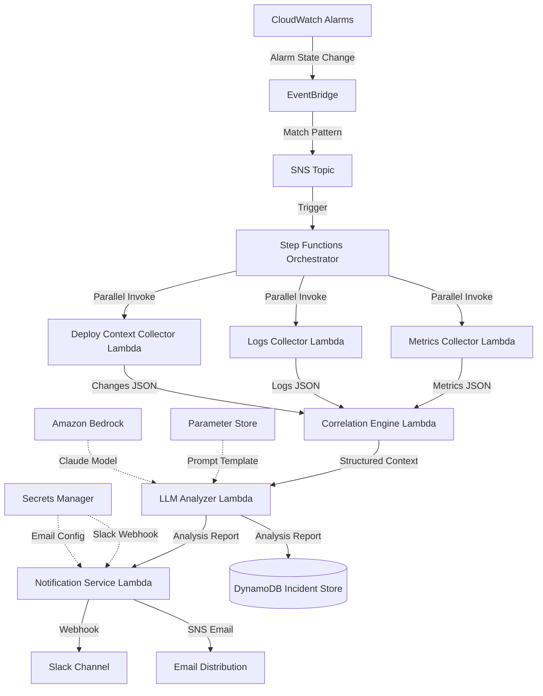

# Design Document: AI-Assisted SRE Incident Analysis System

## Overview

This document describes the technical design for an AI-assisted incident analysis pipeline on AWS. The system follows an event-driven architecture where CloudWatch Alarms trigger a Step Functions orchestrator that coordinates parallel data collection, LLM-based analysis, and human notification. The design emphasizes security (least-privilege IAM), observability (structured logging and metrics), and graceful degradation (partial failures don't block the workflow).

The architecture mirrors production incident management systems like Resolve AI, PagerDuty AIOps, and Datadog Watchdog, where specialized agents collect context in parallel, a correlation layer normalizes data, and an LLM synthesizes insights for human operators.

## Architecture

### High-Level Architecture



### Architecture Patterns

**Event-Driven Architecture**: Components communicate via events (SNS, EventBridge) rather than direct invocation, enabling loose coupling and independent scaling.

**Parallel Fan-Out**: The orchestrator invokes three collectors simultaneously to minimize latency. Each collector is independent and can fail without blocking others.

**Correlation Layer**: A dedicated function normalizes heterogeneous data (metrics, logs, changes) into a unified structure, simplifying downstream processing.

**Advisory-Only AI**: The LLM generates hypotheses and recommendations but has no permissions to modify infrastructure. Humans remain in control.

**Graceful Degradation**: The system continues with partial data if collectors fail, ensuring some analysis is better than none.

### Technology Choices

**AWS Step Functions Express Workflows**: Chosen for cost efficiency (5x cheaper than Standard workflows) and low latency (< 5 min execution). Express workflows are ideal for high-volume, short-duration orchestration.

**AWS Lambda with Python 3.11+**: Chosen for serverless execution, built-in retry logic, and rich AWS SDK support. Python is preferred for data processing and LLM integration.

**Amazon Bedrock with Claude**: Chosen for managed LLM access without infrastructure overhead. Claude excels at structured reasoning and following instructions.

**DynamoDB**: Chosen for serverless, low-latency storage with automatic scaling. On-demand billing mode minimizes costs for portfolio projects.

**EventBridge + SNS**: EventBridge provides pattern matching for alarm events; SNS provides fan-out to multiple subscribers (Step Functions, future integrations).

**Terraform**: Chosen for declarative infrastructure definition, state management, and wide AWS resource support.

## Components and Interfaces

### 1. Incident Detection System

**Responsibilities**:
- Monitor CloudWatch Alarms for state transitions
- Filter alarm events and route to orchestrator
- Provide early cancellation for transient alarms

**Implementation**:
- EventBridge rule matching CloudWatch Alarm state changes
- Event pattern filters for ALARM state only
- SNS topic as integration point for orchestrator

**Input**: CloudWatch Alarm state change event
**Output**: Normalized incident event to SNS topic

**Event Schema**:
```json
{
  "incidentId": "uuid-v4",
  "alarmName": "string",
  "alarmArn": "string",
  "resourceArn": "string",
  "timestamp": "ISO-8601",
  "alarmState": "ALARM",
  "alarmDescription": "string",
  "metricName": "string",
  "namespace": "string"
}
```

### 2. Step Functions Orchestrator

**Responsibilities**:
- Coordinate parallel data collection
- Handle collector failures and timeouts
- Sequence correlation, analysis, and notification
- Emit observability data (logs, metrics, traces)

**State Machine Design**:
```json
{
  "Comment": "AI-Assisted Incident Analysis Workflow",
  "StartAt": "ParallelDataCollection",
  "States": {
    "ParallelDataCollection": {
      "Type": "Parallel",
      "Branches": [
        {"StartAt": "CollectMetrics", "States": {...}},
        {"StartAt": "CollectLogs", "States": {...}},
        {"StartAt": "CollectDeployContext", "States": {...}}
      ],
      "Catch": [{"ErrorEquals": ["States.ALL"], "ResultPath": "$.error", "Next": "CorrelateData"}],
      "Next": "CorrelateData"
    },
    "CorrelateData": {
      "Type": "Task",
      "Resource": "arn:aws:lambda:...:function:correlation-engine",
      "Next": "AnalyzeWithLLM"
    },
    "AnalyzeWithLLM": {
      "Type": "Task",
      "Resource": "arn:aws:lambda:...:function:llm-analyzer",
      "Retry": [{"ErrorEquals": ["ThrottlingException"], "MaxAttempts": 3}],
      "Next": "NotifyAndStore"
    },
    "NotifyAndStore": {
      "Type": "Parallel",
      "Branches": [
        {"StartAt": "SendNotification", "States": {...}},
        {"StartAt": "StoreIncident", "States": {...}}
      ],
      "End": true
    }
  }
}
```

**Timeout Configuration**:
- Collector tasks: 20 seconds each
- Correlation task: 10 seconds
- LLM analysis task: 40 seconds
- Notification task: 15 seconds
- Total workflow: 120 seconds

**Retry Policy**:
- Exponential backoff: 2s, 4s, 8s
- Max attempts: 3
- Retryable errors: ThrottlingException, ServiceException, TooManyRequestsException

### 3. Metrics Collector Lambda

**Responsibilities**:
- Query CloudWatch Metrics API for resource-specific metrics
- Retrieve time-series data for 60 minutes before incident
- Normalize metric data into structured JSON

**Implementation**:
- Python 3.11 Lambda function
- boto3 CloudWatch client
- ARM64 architecture (Graviton2)
- Memory: 512 MB
- Timeout: 20 seconds

**Input**:
```json
{
  "resourceArn": "arn:aws:...",
  "timestamp": "ISO-8601",
  "namespace": "AWS/EC2",
  "metricNames": ["CPUUtilization", "NetworkIn"]
}
```

**Output**:
```json
{
  "status": "success",
  "metrics": [
    {
      "metricName": "CPUUtilization",
      "namespace": "AWS/EC2",
      "datapoints": [
        {"timestamp": "ISO-8601", "value": 85.5, "unit": "Percent"}
      ],
      "statistics": {"avg": 75.2, "max": 95.0, "min": 60.0}
    }
  ],
  "collectionDuration": 1.2
}
```

**Algorithm**:
1. Parse resource ARN to determine AWS service and resource ID
2. Map service to relevant CloudWatch namespace and metrics
3. Calculate time range: [timestamp - 60min, timestamp + 5min]
4. Query GetMetricStatistics with 1-minute period
5. Calculate summary statistics (avg, max, min, p95)
6. Return normalized JSON

**Error Handling**:
- If no metrics found: return empty array with warning
- If API throttled: retry with exponential backoff
- If timeout: return partial results

### 4. Logs Collector Lambda

**Responsibilities**:
- Query CloudWatch Logs API for resource-specific log groups
- Filter for ERROR, WARN, CRITICAL level messages
- Return most relevant log entries

**Implementation**:
- Python 3.11 Lambda function
- boto3 CloudWatch Logs client
- ARM64 architecture
- Memory: 512 MB
- Timeout: 20 seconds

**Input**:
```json
{
  "resourceArn": "arn:aws:...",
  "timestamp": "ISO-8601",
  "logGroupName": "/aws/lambda/my-function"
}
```

**Output**:
```json
{
  "status": "success",
  "logs": [
    {
      "timestamp": "ISO-8601",
      "logLevel": "ERROR",
      "message": "Connection timeout to database",
      "logStream": "2024/01/15/[$LATEST]abc123"
    }
  ],
  "totalMatches": 45,
  "returned": 100,
  "collectionDuration": 2.5
}
```

**Algorithm**:
1. Parse resource ARN to determine log group name
2. Calculate time range: [timestamp - 30min, timestamp + 5min]
3. Use FilterLogEvents with pattern: "ERROR|WARN|CRITICAL"
4. Sort by timestamp descending
5. Return top 100 entries
6. Calculate error frequency statistics

**Error Handling**:
- If log group not found: return empty array
- If no matching logs: return empty array with info
- If API throttled: retry with exponential backoff

### 5. Deploy Context Collector Lambda

**Responsibilities**:
- Query CloudTrail for recent API calls affecting the resource
- Query Systems Manager Parameter Store for configuration changes
- Identify deployments and infrastructure modifications

**Implementation**:
- Python 3.11 Lambda function
- boto3 CloudTrail and SSM clients
- ARM64 architecture
- Memory: 512 MB
- Timeout: 20 seconds

**Input**:
```json
{
  "resourceArn": "arn:aws:...",
  "timestamp": "ISO-8601"
}
```

**Output**:
```json
{
  "status": "success",
  "changes": [
    {
      "timestamp": "ISO-8601",
      "changeType": "deployment",
      "eventName": "UpdateFunctionCode",
      "user": "arn:aws:iam::123456789012:user/deployer",
      "description": "Lambda function code updated"
    }
  ],
  "collectionDuration": 3.1
}
```

**Algorithm**:
1. Parse resource ARN to extract resource type and ID
2. Calculate time range: [timestamp - 24h, timestamp]
3. Query CloudTrail LookupEvents for resource-specific events
4. Filter for mutating events (Create, Update, Delete, Put)
5. Query SSM Parameter Store for parameter changes
6. Merge and sort by timestamp
7. Return top 50 changes

**Error Handling**:
- If CloudTrail not enabled: return empty array with warning
- If no changes found: return empty array
- If API throttled: retry with exponential backoff

### 6. Correlation Engine Lambda

**Responsibilities**:
- Merge outputs from all collectors
- Normalize timestamps and data formats
- Calculate summary statistics
- Ensure output size < 50KB for LLM context window

**Implementation**:
- Python 3.11 Lambda function
- ARM64 architecture
- Memory: 256 MB
- Timeout: 10 seconds

**Input**:
```json
{
  "incident": {...},
  "metrics": {...},
  "logs": {...},
  "changes": {...}
}
```

**Output** (Structured Context):
```json
{
  "incidentId": "uuid",
  "timestamp": "ISO-8601",
  "resource": {
    "arn": "arn:aws:...",
    "type": "lambda",
    "name": "my-function"
  },
  "alarm": {
    "name": "HighErrorRate",
    "metric": "Errors",
    "threshold": 10
  },
  "metrics": {
    "summary": {"errorRate": 15.5, "avgDuration": 250},
    "timeSeries": [...]
  },
  "logs": {
    "errorCount": 45,
    "topErrors": ["Connection timeout", "Memory exceeded"],
    "entries": [...]
  },
  "changes": {
    "recentDeployments": 2,
    "lastDeployment": "ISO-8601",
    "entries": [...]
  },
  "completeness": {
    "metrics": true,
    "logs": true,
    "changes": true
  }
}
```

**Algorithm**:
1. Check which collectors succeeded (completeness tracking)
2. Normalize all timestamps to ISO-8601 UTC
3. Calculate summary statistics for each data source
4. Merge time-series data and sort chronologically
5. Identify correlations (e.g., deployment 5 min before incident)
6. Truncate data if > 50KB (prioritize recent entries)
7. Return structured context

**Data Normalization Rules**:
- All timestamps → ISO-8601 UTC
- All durations → milliseconds
- All percentages → 0-100 scale
- All ARNs → parsed into service/region/account/resource

### 7. LLM Analyzer Lambda

**Responsibilities**:
- Construct structured prompt for Amazon Bedrock
- Invoke Claude model with structured context
- Parse LLM response into analysis report
- Handle LLM failures gracefully

**Implementation**:
- Python 3.11 Lambda function
- boto3 Bedrock Runtime client
- ARM64 architecture
- Memory: 1024 MB (for JSON parsing)
- Timeout: 40 seconds

**Input**: Structured Context from Correlation Engine

**Output** (Analysis Report):
```json
{
  "incidentId": "uuid",
  "timestamp": "ISO-8601",
  "analysis": {
    "rootCauseHypothesis": "Lambda function exhausted memory due to memory leak in recent deployment",
    "confidence": "high",
    "evidence": [
      "Memory utilization increased from 60% to 95% after deployment at 14:23",
      "Error logs show 'MemoryError' starting at 14:25",
      "Deployment occurred 2 minutes before incident"
    ],
    "contributingFactors": [
      "Increased traffic during peak hours",
      "Memory limit not adjusted after code changes"
    ],
    "recommendedActions": [
      "Rollback deployment to previous version",
      "Increase Lambda memory limit to 2048 MB",
      "Investigate memory leak in new code"
    ]
  },
  "metadata": {
    "modelId": "anthropic.claude-v2",
    "modelVersion": "2.1",
    "promptVersion": "v1.2",
    "tokenUsage": {"input": 1500, "output": 300},
    "latency": 2.5
  }
}
```

**Prompt Template** (stored in Parameter Store):
```
You are an expert Site Reliability Engineer analyzing an infrastructure incident.

TASK: Analyze the provided incident data and generate a root-cause hypothesis with supporting evidence.

INPUT DATA:
{structured_context}

OUTPUT FORMAT (JSON):
{
  "rootCauseHypothesis": "Single sentence hypothesis",
  "confidence": "high|medium|low",
  "evidence": ["Specific data point 1", "Specific data point 2"],
  "contributingFactors": ["Factor 1", "Factor 2"],
  "recommendedActions": ["Action 1", "Action 2"]
}

CONSTRAINTS:
- Base hypothesis ONLY on provided data (no speculation)
- Cite specific metrics, logs, or changes as evidence
- Confidence = high if multiple correlated signals, medium if single signal, low if ambiguous
- Recommended actions must be specific and actionable
- Keep response under 500 tokens

ANALYSIS:
```

**Algorithm**:
1. Retrieve prompt template from Parameter Store
2. Inject structured context into prompt
3. Invoke Bedrock with:
   - Model: anthropic.claude-v2
   - Temperature: 0.3 (deterministic)
   - Max tokens: 1000
   - Stop sequences: ["</analysis>"]
4. Parse JSON response
5. Validate response structure
6. Add metadata (model version, token usage, latency)
7. Return analysis report

**Error Handling**:
- If Bedrock throttled: retry with exponential backoff (3 attempts)
- If Bedrock timeout: return fallback report
- If JSON parsing fails: extract text and wrap in fallback structure
- If model returns invalid confidence: default to "low"

**Fallback Report**:
```json
{
  "rootCauseHypothesis": "Analysis unavailable due to LLM service error",
  "confidence": "none",
  "evidence": [],
  "contributingFactors": [],
  "recommendedActions": ["Review incident data manually", "Check LLM service status"]
}
```

### 8. Notification Service Lambda

**Responsibilities**:
- Format analysis report as human-readable message
- Send to Slack via webhook
- Send to email via SNS
- Handle delivery failures gracefully

**Implementation**:
- Python 3.11 Lambda function
- requests library for Slack webhook
- boto3 SNS client for email
- ARM64 architecture
- Memory: 256 MB
- Timeout: 15 seconds

**Input**: Analysis Report from LLM Analyzer

**Output**:
```json
{
  "status": "success",
  "deliveryStatus": {
    "slack": "delivered",
    "email": "delivered"
  },
  "notificationDuration": 1.8
}
```

**Slack Message Format**:
```
🚨 *Incident Alert: High Error Rate*

*Resource:* Lambda function `my-function`
*Severity:* High
*Time:* 2024-01-15 14:30:00 UTC

*Root Cause Hypothesis (High Confidence):*
Lambda function exhausted memory due to memory leak in recent deployment

*Evidence:*
• Memory utilization increased from 60% to 95% after deployment at 14:23
• Error logs show 'MemoryError' starting at 14:25
• Deployment occurred 2 minutes before incident

*Recommended Actions:*
1. Rollback deployment to previous version
2. Increase Lambda memory limit to 2048 MB
3. Investigate memory leak in new code

<https://console.aws.amazon.com/dynamodb/incident/uuid|View Full Incident Details>
```

**Email Format**: Plain text version of Slack message with HTML formatting

**Algorithm**:
1. Retrieve Slack webhook URL from Secrets Manager
2. Format analysis report as Slack blocks
3. POST to Slack webhook with retry logic
4. Retrieve email topic ARN from environment variable
5. Format analysis report as plain text + HTML
6. Publish to SNS topic
7. Return delivery status

**Error Handling**:
- If Slack fails: log error and continue to email
- If email fails: log error and return partial success
- If both fail: return failure status
- Retry Slack webhook 2 times with 1s delay

### 9. DynamoDB Incident Store

**Responsibilities**:
- Persist complete incident records
- Support querying by resource, time range, severity
- Retain data for 90 days with automatic expiration

**Schema Design**:

**Table Name**: `incident-analysis-store`

**Primary Key**:
- Partition Key: `incidentId` (String, UUID)
- Sort Key: `timestamp` (String, ISO-8601)

**Attributes**:
```json
{
  "incidentId": "uuid",
  "timestamp": "ISO-8601",
  "resourceArn": "arn:aws:...",
  "resourceType": "lambda",
  "alarmName": "HighErrorRate",
  "severity": "high",
  "structuredContext": {...},
  "analysisReport": {...},
  "notificationStatus": {...},
  "ttl": 1234567890
}
```

**Global Secondary Indexes**:

1. **ResourceIndex**:
   - Partition Key: `resourceArn`
   - Sort Key: `timestamp`
   - Use case: Query all incidents for a specific resource

2. **SeverityIndex**:
   - Partition Key: `severity`
   - Sort Key: `timestamp`
   - Use case: Query high-severity incidents across all resources

**TTL Configuration**:
- TTL attribute: `ttl`
- Expiration: 90 days from incident timestamp
- Automatic deletion by DynamoDB

**Capacity Mode**: On-demand (pay-per-request)

**Encryption**: AWS KMS with customer-managed key

**Backup**: Point-in-time recovery enabled

### 10. IAM Roles and Permissions

**Principle**: Each Lambda function has its own IAM role with minimum required permissions.

**Metrics Collector Role**:
```json
{
  "Version": "2012-10-17",
  "Statement": [
    {
      "Effect": "Allow",
      "Action": [
        "cloudwatch:GetMetricStatistics",
        "cloudwatch:ListMetrics"
      ],
      "Resource": "*"
    },
    {
      "Effect": "Allow",
      "Action": [
        "logs:CreateLogGroup",
        "logs:CreateLogStream",
        "logs:PutLogEvents"
      ],
      "Resource": "arn:aws:logs:*:*:log-group:/aws/lambda/metrics-collector*"
    }
  ]
}
```

**Logs Collector Role**:
```json
{
  "Version": "2012-10-17",
  "Statement": [
    {
      "Effect": "Allow",
      "Action": [
        "logs:FilterLogEvents",
        "logs:DescribeLogGroups",
        "logs:DescribeLogStreams"
      ],
      "Resource": "*"
    },
    {
      "Effect": "Allow",
      "Action": [
        "logs:CreateLogGroup",
        "logs:CreateLogStream",
        "logs:PutLogEvents"
      ],
      "Resource": "arn:aws:logs:*:*:log-group:/aws/lambda/logs-collector*"
    }
  ]
}
```

**Deploy Context Collector Role**:
```json
{
  "Version": "2012-10-17",
  "Statement": [
    {
      "Effect": "Allow",
      "Action": [
        "ssm:GetParameter",
        "ssm:GetParameterHistory"
      ],
      "Resource": "arn:aws:ssm:*:*:parameter/*"
    },
    {
      "Effect": "Allow",
      "Action": [
        "cloudtrail:LookupEvents"
      ],
      "Resource": "*"
    },
    {
      "Effect": "Allow",
      "Action": [
        "logs:CreateLogGroup",
        "logs:CreateLogStream",
        "logs:PutLogEvents"
      ],
      "Resource": "arn:aws:logs:*:*:log-group:/aws/lambda/deploy-context-collector*"
    }
  ]
}
```

**LLM Analyzer Role** (CRITICAL - Most Restrictive):
```json
{
  "Version": "2012-10-17",
  "Statement": [
    {
      "Effect": "Allow",
      "Action": [
        "bedrock:InvokeModel"
      ],
      "Resource": "arn:aws:bedrock:*::foundation-model/anthropic.claude-v2"
    },
    {
      "Effect": "Allow",
      "Action": [
        "ssm:GetParameter"
      ],
      "Resource": "arn:aws:ssm:*:*:parameter/incident-analysis/prompt-template"
    },
    {
      "Effect": "Allow",
      "Action": [
        "logs:CreateLogGroup",
        "logs:CreateLogStream",
        "logs:PutLogEvents"
      ],
      "Resource": "arn:aws:logs:*:*:log-group:/aws/lambda/llm-analyzer*"
    },
    {
      "Effect": "Deny",
      "Action": [
        "ec2:*",
        "rds:*",
        "iam:*",
        "s3:Delete*",
        "dynamodb:Delete*",
        "lambda:Update*",
        "lambda:Delete*"
      ],
      "Resource": "*"
    }
  ]
}
```

**Notification Service Role**:
```json
{
  "Version": "2012-10-17",
  "Statement": [
    {
      "Effect": "Allow",
      "Action": [
        "secretsmanager:GetSecretValue"
      ],
      "Resource": "arn:aws:secretsmanager:*:*:secret:incident-analysis/slack-webhook*"
    },
    {
      "Effect": "Allow",
      "Action": [
        "sns:Publish"
      ],
      "Resource": "arn:aws:sns:*:*:incident-notifications"
    },
    {
      "Effect": "Allow",
      "Action": [
        "logs:CreateLogGroup",
        "logs:CreateLogStream",
        "logs:PutLogEvents"
      ],
      "Resource": "arn:aws:logs:*:*:log-group:/aws/lambda/notification-service*"
    }
  ]
}
```

**Step Functions Orchestrator Role**:
```json
{
  "Version": "2012-10-17",
  "Statement": [
    {
      "Effect": "Allow",
      "Action": [
        "lambda:InvokeFunction"
      ],
      "Resource": [
        "arn:aws:lambda:*:*:function:metrics-collector",
        "arn:aws:lambda:*:*:function:logs-collector",
        "arn:aws:lambda:*:*:function:deploy-context-collector",
        "arn:aws:lambda:*:*:function:correlation-engine",
        "arn:aws:lambda:*:*:function:llm-analyzer",
        "arn:aws:lambda:*:*:function:notification-service"
      ]
    },
    {
      "Effect": "Allow",
      "Action": [
        "dynamodb:PutItem"
      ],
      "Resource": "arn:aws:dynamodb:*:*:table/incident-analysis-store"
    },
    {
      "Effect": "Allow",
      "Action": [
        "xray:PutTraceSegments",
        "xray:PutTelemetryRecords"
      ],
      "Resource": "*"
    },
    {
      "Effect": "Allow",
      "Action": [
        "logs:CreateLogGroup",
        "logs:CreateLogStream",
        "logs:PutLogEvents"
      ],
      "Resource": "arn:aws:logs:*:*:log-group:/aws/vendedlogs/states/incident-orchestrator*"
    }
  ]
}
```

## Data Models

### Incident Event

```python
from dataclasses import dataclass
from datetime import datetime
from typing import Optional

@dataclass
class IncidentEvent:
    incident_id: str  # UUID v4
    alarm_name: str
    alarm_arn: str
    resource_arn: str
    timestamp: datetime
    alarm_state: str  # "ALARM" | "OK" | "INSUFFICIENT_DATA"
    alarm_description: Optional[str]
    metric_name: str
    namespace: str
    
    def to_dict(self) -> dict:
        return {
            "incidentId": self.incident_id,
            "alarmName": self.alarm_name,
            "alarmArn": self.alarm_arn,
            "resourceArn": self.resource_arn,
            "timestamp": self.timestamp.isoformat(),
            "alarmState": self.alarm_state,
            "alarmDescription": self.alarm_description,
            "metricName": self.metric_name,
            "namespace": self.namespace
        }
```

### Metrics Data

```python
from dataclasses import dataclass
from typing import List, Dict

@dataclass
class MetricDatapoint:
    timestamp: datetime
    value: float
    unit: str

@dataclass
class MetricStatistics:
    avg: float
    max: float
    min: float
    p95: Optional[float]

@dataclass
class MetricData:
    metric_name: str
    namespace: str
    datapoints: List[MetricDatapoint]
    statistics: MetricStatistics

@dataclass
class MetricsCollectorOutput:
    status: str  # "success" | "partial" | "failed"
    metrics: List[MetricData]
    collection_duration: float
    error: Optional[str]
```

### Logs Data

```python
from dataclasses import dataclass
from typing import List, Optional

@dataclass
class LogEntry:
    timestamp: datetime
    log_level: str  # "ERROR" | "WARN" | "CRITICAL" | "INFO"
    message: str
    log_stream: str

@dataclass
class LogsCollectorOutput:
    status: str  # "success" | "partial" | "failed"
    logs: List[LogEntry]
    total_matches: int
    returned: int
    collection_duration: float
    error: Optional[str]
```

### Changes Data

```python
from dataclasses import dataclass
from typing import List, Optional

@dataclass
class ChangeEvent:
    timestamp: datetime
    change_type: str  # "deployment" | "configuration" | "infrastructure"
    event_name: str
    user: str
    description: str

@dataclass
class DeployContextCollectorOutput:
    status: str  # "success" | "partial" | "failed"
    changes: List[ChangeEvent]
    collection_duration: float
    error: Optional[str]
```

### Structured Context

```python
from dataclasses import dataclass
from typing import Dict, List, Optional

@dataclass
class ResourceInfo:
    arn: str
    type: str  # "lambda" | "ec2" | "rds" | "ecs"
    name: str

@dataclass
class AlarmInfo:
    name: str
    metric: str
    threshold: float

@dataclass
class CompletenessInfo:
    metrics: bool
    logs: bool
    changes: bool

@dataclass
class StructuredContext:
    incident_id: str
    timestamp: datetime
    resource: ResourceInfo
    alarm: AlarmInfo
    metrics: Dict
    logs: Dict
    changes: Dict
    completeness: CompletenessInfo
    
    def size_bytes(self) -> int:
        import json
        return len(json.dumps(self.to_dict()).encode('utf-8'))
```

### Analysis Report

```python
from dataclasses import dataclass
from typing import List, Optional

@dataclass
class AnalysisMetadata:
    model_id: str
    model_version: str
    prompt_version: str
    token_usage: Dict[str, int]
    latency: float

@dataclass
class Analysis:
    root_cause_hypothesis: str
    confidence: str  # "high" | "medium" | "low" | "none"
    evidence: List[str]
    contributing_factors: List[str]
    recommended_actions: List[str]

@dataclass
class AnalysisReport:
    incident_id: str
    timestamp: datetime
    analysis: Analysis
    metadata: AnalysisMetadata
```

### Notification Status

```python
from dataclasses import dataclass
from typing import Optional

@dataclass
class DeliveryStatus:
    slack: str  # "delivered" | "failed" | "skipped"
    email: str  # "delivered" | "failed" | "skipped"
    slack_error: Optional[str]
    email_error: Optional[str]

@dataclass
class NotificationOutput:
    status: str  # "success" | "partial" | "failed"
    delivery_status: DeliveryStatus
    notification_duration: float
```

### Incident Record (DynamoDB)

```python
from dataclasses import dataclass
from typing import Dict

@dataclass
class IncidentRecord:
    incident_id: str  # Partition key
    timestamp: str  # Sort key (ISO-8601)
    resource_arn: str
    resource_type: str
    alarm_name: str
    severity: str  # "critical" | "high" | "medium" | "low"
    structured_context: Dict
    analysis_report: Dict
    notification_status: Dict
    ttl: int  # Unix timestamp for 90 days from now
    
    def to_dynamodb_item(self) -> Dict:
        return {
            "incidentId": {"S": self.incident_id},
            "timestamp": {"S": self.timestamp},
            "resourceArn": {"S": self.resource_arn},
            "resourceType": {"S": self.resource_type},
            "alarmName": {"S": self.alarm_name},
            "severity": {"S": self.severity},
            "structuredContext": {"S": json.dumps(self.structured_context)},
            "analysisReport": {"S": json.dumps(self.analysis_report)},
            "notificationStatus": {"S": json.dumps(self.notification_status)},
            "ttl": {"N": str(self.ttl)}
        }
```


## Correctness Properties

A property is a characteristic or behavior that should hold true across all valid executions of a system—essentially, a formal statement about what the system should do. Properties serve as the bridge between human-readable specifications and machine-verifiable correctness guarantees.

### Property Reflection

After analyzing all acceptance criteria, I identified several areas of redundancy:

1. **Time Range Calculations**: Requirements 3.1, 4.1, and 5.1 all test time range calculation logic. These can be combined into a single property about time range calculation correctness.

2. **Output Format Validation**: Requirements 3.3, 4.4, and 5.3 all test JSON structure validation. These can be combined into a single property about output schema compliance.

3. **Empty Data Handling**: Requirements 3.4, 4.5, and 5.4 are all edge cases for missing data. These will be handled by property test generators rather than separate properties.

4. **IAM Policy Validation**: Requirements 10.1-10.7 are all examples of IAM policy validation. These will be tested as unit test examples rather than properties.

5. **Graceful Degradation**: Requirements 12.1-12.3 all test collector failure handling. These can be combined into a single property about partial data handling.

6. **Infrastructure Configuration**: Requirements 13.1-13.6, 17.1-17.6 are all examples of Terraform configuration validation, not runtime properties.

7. **CI/CD Configuration**: Requirements 15.1-15.6 are all examples of GitHub Actions workflow validation, not runtime properties.

8. **Documentation**: Requirements 19.1, 19.3, 19.4 are examples of file existence checks, not runtime properties.

### Core Properties

#### Property 1: Event Routing Completeness
*For any* CloudWatch Alarm state change event, when the event is published to EventBridge, the resulting incident event must contain all required fields (incident ID, alarm name, resource ARN, timestamp, alarm state).

**Validates: Requirements 1.1, 1.2, 1.3**

#### Property 2: Concurrent Incident Independence
*For any* set of simultaneous alarm events, each alarm must be processed as a separate incident with a unique incident ID.

**Validates: Requirements 1.4**

#### Property 3: Transient Alarm Cancellation
*For any* alarm that transitions to ALARM state and then to OK state within 30 seconds, the incident workflow must be cancelled.

**Validates: Requirements 1.5**

#### Property 4: Parallel Collector Invocation
*For any* valid incident event, the orchestrator must invoke all three collectors (metrics, logs, deploy context) in parallel.

**Validates: Requirements 2.1**

#### Property 5: Workflow Sequencing
*For any* incident workflow, the execution order must be: parallel collection → correlation → LLM analysis → parallel notification and storage.

**Validates: Requirements 2.2, 2.3, 2.4**

#### Property 6: Graceful Degradation with Partial Data
*For any* incident workflow where one or more collectors fail, the workflow must continue with available data and mark the incident as partial in the completeness indicator.

**Validates: Requirements 2.5, 12.1, 12.2, 12.3, 12.6**

#### Property 7: Structured Logging with Correlation IDs
*For any* incident workflow, all emitted logs must be valid JSON and contain the same correlation ID (incident ID).

**Validates: Requirements 2.7, 11.1, 11.2**

#### Property 8: Time Range Calculation Correctness
*For any* collector (metrics, logs, deploy context) receiving a timestamp, the calculated query time range must be correct relative to the incident timestamp (metrics: -60min to +5min, logs: -30min to +5min, changes: -24h to incident time).

**Validates: Requirements 3.1, 4.1, 5.1**

#### Property 9: Collector Output Schema Compliance
*For any* collector output (metrics, logs, deploy context), the returned JSON must conform to the defined schema with required fields (status, data array, collection_duration).

**Validates: Requirements 3.3, 4.4, 5.3**

#### Property 10: Log Level Filtering
*For any* set of log entries, the logs collector must return only entries with log levels ERROR, WARN, or CRITICAL.

**Validates: Requirements 4.2**

#### Property 11: Log Result Limiting and Ordering
*For any* log query returning more than 100 entries, the logs collector must return exactly 100 entries sorted in chronological order.

**Validates: Requirements 4.3**

#### Property 12: Change Event Classification
*For any* CloudTrail event, the deploy context collector must correctly classify it as deployment, configuration, or infrastructure change based on the event name.

**Validates: Requirements 5.2**

#### Property 13: Data Correlation and Merging
*For any* set of collector outputs, the correlation engine must merge them into a single structured context object containing all available data.

**Validates: Requirements 6.1**

#### Property 14: Timestamp Normalization
*For any* structured context, all timestamps must be in ISO 8601 UTC format regardless of input format.

**Validates: Requirements 6.2**

#### Property 15: Deduplication and Chronological Sorting
*For any* structured context with duplicate entries, the correlation engine must remove duplicates and sort all events chronologically.

**Validates: Requirements 6.3**

#### Property 16: Summary Statistics Calculation
*For any* structured context, the correlation engine must calculate correct summary statistics (metric averages, log error counts, change frequency).

**Validates: Requirements 6.4**

#### Property 17: Context Size Constraint
*For any* structured context, the serialized JSON size must not exceed 50KB. If input data exceeds this, the correlation engine must truncate while prioritizing recent entries.

**Validates: Requirements 6.6**

#### Property 18: LLM Prompt Construction
*For any* structured context, the LLM analyzer must construct a prompt that includes the complete context and follows the template format from Parameter Store.

**Validates: Requirements 7.1, 16.1**

#### Property 19: LLM Response Parsing
*For any* LLM response (valid or malformed), the LLM analyzer must parse it into a structured analysis report or return a fallback report if parsing fails.

**Validates: Requirements 7.4, 7.5**

#### Property 20: Analysis Report Metadata Completeness
*For any* analysis report, the metadata must include model ID, model version, prompt version, token usage, and latency.

**Validates: Requirements 7.7, 16.5**

#### Property 21: Notification Message Completeness
*For any* analysis report, the formatted notification must include incident ID, affected resource, severity, root-cause hypothesis, recommended actions, and a link to the incident store.

**Validates: Requirements 8.1, 8.4, 8.5**

#### Property 22: Notification Graceful Degradation
*For any* notification attempt where Slack delivery fails, the notification service must still attempt email delivery.

**Validates: Requirements 8.6**

#### Property 23: Incident Persistence Completeness
*For any* completed incident analysis, the stored DynamoDB record must contain all required fields (incident ID, timestamp, resource ARN, alarm details, structured context, analysis report, notification status).

**Validates: Requirements 9.1, 9.2**

#### Property 24: Incident Query Capability
*For any* stored incident, it must be retrievable by querying on resource ARN, time range, or severity using the appropriate DynamoDB index.

**Validates: Requirements 9.3**

#### Property 25: TTL Configuration Correctness
*For any* stored incident, the TTL field must be set to exactly 90 days (7,776,000 seconds) from the incident timestamp.

**Validates: Requirements 9.4**

#### Property 26: Error Logging with Stack Traces
*For any* component failure, the emitted error log must include the error message, stack trace, and incident context.

**Validates: Requirements 11.6**

#### Property 27: LLM Failure Notification
*For any* incident where the LLM analyzer fails, the notification service must send a notification indicating analysis is unavailable.

**Validates: Requirements 12.4**

#### Property 28: Storage Despite Notification Failure
*For any* incident where the notification service fails, the incident store must still persist the complete incident record.

**Validates: Requirements 12.5**

#### Property 29: Secrets Retrieval at Runtime
*For any* notification service invocation, Slack webhook URLs and email configuration must be retrieved from Secrets Manager at runtime, never from environment variables or hardcoded values.

**Validates: Requirements 14.3**

#### Property 30: Retry Exhaustion Handling
*For any* Lambda function that exhausts all retry attempts, the orchestrator must mark that data source as unavailable and continue the workflow.

**Validates: Requirements 20.4**

#### Property 31: Error Classification for Retries
*For any* error encountered by a Lambda function, the system must correctly classify it as retryable (ThrottlingException, ServiceException, TooManyRequestsException) or non-retryable (ValidationException, AccessDeniedException) and only retry retryable errors.

**Validates: Requirements 20.5**

### Example-Based Tests

The following requirements are best validated through specific example tests rather than property-based tests:

**Workflow Performance** (Requirement 2.6): Integration test verifying end-to-end workflow completes within 120 seconds.

**LLM Invocation Parameters** (Requirement 7.2): Unit test verifying Bedrock is invoked with Claude model and temperature 0.3.

**LLM Prompt Requirements** (Requirement 7.3): Unit test verifying prompt template includes all required sections.

**Slack Integration** (Requirement 8.2): Integration test with mocked webhook verifying message format.

**Email Integration** (Requirement 8.3): Integration test with mocked SNS verifying message publishing.

**IAM Policy Validation** (Requirements 10.1-10.8): Unit tests verifying each IAM role policy document contains only allowed permissions and explicit denies for restricted services.

**Terraform Configuration** (Requirements 13.1-13.6): Terraform validation tests verifying configuration is valid and outputs are defined.

**Secrets Management** (Requirements 14.1, 14.2, 14.4): Unit tests verifying Terraform creates secrets and code doesn't expose them.

**CI/CD Pipeline** (Requirements 15.1-15.6): GitHub Actions workflow validation tests.

**Prompt Template Structure** (Requirements 16.2-16.4): Unit test verifying template contains required sections.

**Prompt Template Updates** (Requirement 16.6): Integration test verifying dynamic template loading.

**Cost Optimization Configuration** (Requirements 17.1-17.6): Terraform validation tests verifying resource configurations.

**Test Coverage** (Requirements 18.1-18.6): CI/CD pipeline verification and coverage report validation.

**Documentation** (Requirements 19.1, 19.3, 19.4): File existence tests.

**Retry Configuration** (Requirements 20.1-20.3): Unit tests verifying Step Functions state machine and SDK retry configuration.


## Error Handling

### Error Categories

The system distinguishes between three categories of errors:

1. **Retryable Errors**: Transient failures that may succeed on retry
   - ThrottlingException (AWS API rate limits)
   - ServiceException (temporary AWS service issues)
   - TooManyRequestsException (Bedrock rate limits)
   - Timeout errors (network latency)

2. **Non-Retryable Errors**: Permanent failures that won't succeed on retry
   - ValidationException (invalid input data)
   - AccessDeniedException (IAM permission issues)
   - ResourceNotFoundException (missing AWS resources)
   - InvalidParameterException (malformed API requests)

3. **Degradable Errors**: Failures that allow partial system operation
   - Single collector failure (continue with other collectors)
   - LLM analysis failure (send notification without analysis)
   - Notification failure (still persist to incident store)

### Error Handling Strategies

#### Lambda Function Error Handling

All Lambda functions follow this error handling pattern:

```python
import logging
import traceback
from typing import Dict, Any

logger = logging.getLogger()
logger.setLevel(logging.INFO)

def lambda_handler(event: Dict[str, Any], context: Any) -> Dict[str, Any]:
    correlation_id = event.get('incidentId', 'unknown')
    
    try:
        logger.info({
            "message": "Function invoked",
            "correlationId": correlation_id,
            "event": event
        })
        
        # Main function logic
        result = process_event(event)
        
        logger.info({
            "message": "Function completed successfully",
            "correlationId": correlation_id,
            "result": result
        })
        
        return {
            "status": "success",
            "data": result,
            "correlationId": correlation_id
        }
        
    except ValidationException as e:
        # Non-retryable error - log and return error response
        logger.error({
            "message": "Validation error",
            "correlationId": correlation_id,
            "error": str(e),
            "errorType": "ValidationException"
        })
        return {
            "status": "failed",
            "error": str(e),
            "errorType": "ValidationException",
            "correlationId": correlation_id
        }
        
    except (ThrottlingException, ServiceException) as e:
        # Retryable error - log and raise for Step Functions retry
        logger.warning({
            "message": "Retryable error encountered",
            "correlationId": correlation_id,
            "error": str(e),
            "errorType": type(e).__name__
        })
        raise
        
    except Exception as e:
        # Unexpected error - log with stack trace
        logger.error({
            "message": "Unexpected error",
            "correlationId": correlation_id,
            "error": str(e),
            "errorType": type(e).__name__,
            "stackTrace": traceback.format_exc()
        })
        return {
            "status": "failed",
            "error": str(e),
            "errorType": "UnexpectedError",
            "correlationId": correlation_id
        }
```

#### Step Functions Error Handling

The Step Functions state machine uses Catch and Retry blocks:

```json
{
  "CollectMetrics": {
    "Type": "Task",
    "Resource": "arn:aws:lambda:...:function:metrics-collector",
    "Retry": [
      {
        "ErrorEquals": ["ThrottlingException", "ServiceException", "TooManyRequestsException"],
        "IntervalSeconds": 2,
        "MaxAttempts": 3,
        "BackoffRate": 2.0
      }
    ],
    "Catch": [
      {
        "ErrorEquals": ["States.ALL"],
        "ResultPath": "$.metricsError",
        "Next": "CorrelateData"
      }
    ]
  }
}
```

#### Correlation Engine Error Handling

The correlation engine handles missing collector data:

```python
def correlate_data(event: Dict[str, Any]) -> Dict[str, Any]:
    incident = event['incident']
    
    # Check which collectors succeeded
    completeness = {
        "metrics": "metricsError" not in event,
        "logs": "logsError" not in event,
        "changes": "changesError" not in event
    }
    
    # Extract available data
    metrics = event.get('metrics', {}).get('data', {}) if completeness['metrics'] else {}
    logs = event.get('logs', {}).get('data', {}) if completeness['logs'] else {}
    changes = event.get('changes', {}).get('data', {}) if completeness['changes'] else {}
    
    # Merge into structured context
    structured_context = {
        "incidentId": incident['incidentId'],
        "timestamp": incident['timestamp'],
        "resource": parse_resource_arn(incident['resourceArn']),
        "alarm": extract_alarm_info(incident),
        "metrics": metrics,
        "logs": logs,
        "changes": changes,
        "completeness": completeness
    }
    
    return structured_context
```

#### LLM Analyzer Fallback

The LLM analyzer provides a fallback report on failure:

```python
def analyze_with_llm(structured_context: Dict[str, Any]) -> Dict[str, Any]:
    try:
        # Invoke Bedrock
        response = bedrock_client.invoke_model(
            modelId="anthropic.claude-v2",
            body=json.dumps({
                "prompt": construct_prompt(structured_context),
                "temperature": 0.3,
                "max_tokens": 1000
            })
        )
        
        # Parse response
        analysis = parse_llm_response(response)
        
        return {
            "incidentId": structured_context['incidentId'],
            "timestamp": datetime.utcnow().isoformat(),
            "analysis": analysis,
            "metadata": extract_metadata(response)
        }
        
    except Exception as e:
        logger.error(f"LLM analysis failed: {e}")
        
        # Return fallback report
        return {
            "incidentId": structured_context['incidentId'],
            "timestamp": datetime.utcnow().isoformat(),
            "analysis": {
                "rootCauseHypothesis": "Analysis unavailable due to LLM service error",
                "confidence": "none",
                "evidence": [],
                "contributingFactors": [],
                "recommendedActions": [
                    "Review incident data manually",
                    "Check LLM service status",
                    f"Error: {str(e)}"
                ]
            },
            "metadata": {
                "modelId": "fallback",
                "error": str(e)
            }
        }
```

#### Notification Service Graceful Degradation

The notification service attempts both channels independently:

```python
def send_notifications(analysis_report: Dict[str, Any]) -> Dict[str, Any]:
    delivery_status = {
        "slack": "skipped",
        "email": "skipped",
        "slackError": None,
        "emailError": None
    }
    
    # Attempt Slack notification
    try:
        send_to_slack(analysis_report)
        delivery_status["slack"] = "delivered"
    except Exception as e:
        logger.error(f"Slack notification failed: {e}")
        delivery_status["slack"] = "failed"
        delivery_status["slackError"] = str(e)
    
    # Attempt email notification (independent of Slack result)
    try:
        send_to_email(analysis_report)
        delivery_status["email"] = "delivered"
    except Exception as e:
        logger.error(f"Email notification failed: {e}")
        delivery_status["email"] = "failed"
        delivery_status["emailError"] = str(e)
    
    # Determine overall status
    if delivery_status["slack"] == "delivered" or delivery_status["email"] == "delivered":
        status = "success" if delivery_status["slack"] == "delivered" and delivery_status["email"] == "delivered" else "partial"
    else:
        status = "failed"
    
    return {
        "status": status,
        "deliveryStatus": delivery_status
    }
```

### Circuit Breaker Pattern

For external service calls (Bedrock, Slack webhook), implement a circuit breaker to prevent cascading failures:

```python
from enum import Enum
from datetime import datetime, timedelta

class CircuitState(Enum):
    CLOSED = "closed"  # Normal operation
    OPEN = "open"      # Failing, reject requests
    HALF_OPEN = "half_open"  # Testing recovery

class CircuitBreaker:
    def __init__(self, failure_threshold: int = 5, timeout: int = 60):
        self.failure_threshold = failure_threshold
        self.timeout = timeout
        self.failure_count = 0
        self.last_failure_time = None
        self.state = CircuitState.CLOSED
    
    def call(self, func, *args, **kwargs):
        if self.state == CircuitState.OPEN:
            if datetime.utcnow() - self.last_failure_time > timedelta(seconds=self.timeout):
                self.state = CircuitState.HALF_OPEN
            else:
                raise Exception("Circuit breaker is OPEN")
        
        try:
            result = func(*args, **kwargs)
            self.on_success()
            return result
        except Exception as e:
            self.on_failure()
            raise
    
    def on_success(self):
        self.failure_count = 0
        self.state = CircuitState.CLOSED
    
    def on_failure(self):
        self.failure_count += 1
        self.last_failure_time = datetime.utcnow()
        
        if self.failure_count >= self.failure_threshold:
            self.state = CircuitState.OPEN
```

## Testing Strategy

### Dual Testing Approach

The system uses both unit tests and property-based tests for comprehensive coverage:

**Unit Tests**: Validate specific examples, edge cases, and error conditions
- Specific input/output examples
- Integration points between components
- Edge cases (empty data, malformed input)
- Error conditions (API failures, timeouts)

**Property-Based Tests**: Validate universal properties across all inputs
- Universal properties that hold for all inputs
- Comprehensive input coverage through randomization
- Minimum 100 iterations per property test

Both approaches are complementary and necessary. Unit tests catch concrete bugs with specific inputs, while property tests verify general correctness across the input space.

### Property-Based Testing Framework

**Python**: Use Hypothesis library for property-based testing

```python
from hypothesis import given, strategies as st
import pytest

@given(
    alarm_name=st.text(min_size=1, max_size=255),
    resource_arn=st.from_regex(r'arn:aws:[a-z0-9-]+:[a-z0-9-]+:\d{12}:.+'),
    timestamp=st.datetimes()
)
@pytest.mark.property_test
@pytest.mark.tag("Feature: ai-sre-incident-analysis, Property 1: Event Routing Completeness")
def test_event_routing_completeness(alarm_name, resource_arn, timestamp):
    """
    Property 1: For any CloudWatch Alarm state change event, the resulting
    incident event must contain all required fields.
    """
    # Create alarm event
    alarm_event = create_alarm_event(alarm_name, resource_arn, timestamp)
    
    # Process through event routing
    incident_event = process_alarm_event(alarm_event)
    
    # Verify all required fields present
    assert 'incidentId' in incident_event
    assert 'alarmName' in incident_event
    assert 'resourceArn' in incident_event
    assert 'timestamp' in incident_event
    assert 'alarmState' in incident_event
    
    # Verify field values
    assert incident_event['alarmName'] == alarm_name
    assert incident_event['resourceArn'] == resource_arn
```

### Test Configuration

**Hypothesis Configuration**:
```python
from hypothesis import settings, Verbosity

# Configure for CI/CD
settings.register_profile("ci", max_examples=100, verbosity=Verbosity.verbose)
settings.register_profile("dev", max_examples=20, verbosity=Verbosity.normal)

# Load profile from environment
settings.load_profile(os.getenv("HYPOTHESIS_PROFILE", "dev"))
```

**Property Test Tagging**:
Each property test must include a tag comment referencing the design document property:

```python
@pytest.mark.tag("Feature: ai-sre-incident-analysis, Property 8: Time Range Calculation Correctness")
def test_time_range_calculation():
    """Property 8: Validates Requirements 3.1, 4.1, 5.1"""
    pass
```

### Test Organization

```
tests/
├── unit/
│   ├── test_metrics_collector.py
│   ├── test_logs_collector.py
│   ├── test_deploy_context_collector.py
│   ├── test_correlation_engine.py
│   ├── test_llm_analyzer.py
│   └── test_notification_service.py
├── property/
│   ├── test_event_routing_properties.py
│   ├── test_collector_properties.py
│   ├── test_correlation_properties.py
│   ├── test_llm_properties.py
│   └── test_notification_properties.py
├── integration/
│   ├── test_end_to_end_workflow.py
│   ├── test_partial_failure_scenarios.py
│   └── test_performance.py
├── infrastructure/
│   ├── test_iam_policies.py
│   ├── test_terraform_validation.py
│   └── test_resource_tagging.py
└── conftest.py  # Shared fixtures and mocks
```

### Key Test Scenarios

**Unit Test Examples**:

1. **Metrics Collector - Empty Data**:
```python
def test_metrics_collector_empty_data():
    """Test that empty metrics return empty array with warning"""
    event = {"resourceArn": "arn:aws:lambda:...", "timestamp": "2024-01-15T14:30:00Z"}
    
    with mock_cloudwatch_empty_response():
        result = metrics_collector.lambda_handler(event, {})
    
    assert result['status'] == 'success'
    assert result['metrics'] == []
    assert 'No metrics found' in caplog.text
```

2. **LLM Analyzer - Fallback Report**:
```python
def test_llm_analyzer_fallback_on_failure():
    """Test that LLM failure returns fallback report"""
    context = create_structured_context()
    
    with mock_bedrock_failure():
        result = llm_analyzer.lambda_handler({"structuredContext": context}, {})
    
    assert result['analysis']['rootCauseHypothesis'] == "Analysis unavailable due to LLM service error"
    assert result['analysis']['confidence'] == "none"
```

3. **IAM Policy Validation**:
```python
def test_llm_analyzer_iam_policy_restrictive():
    """Test that LLM analyzer has only Bedrock permissions"""
    policy = load_iam_policy("llm_analyzer_role")
    
    allowed_actions = extract_allowed_actions(policy)
    assert allowed_actions == ["bedrock:InvokeModel", "ssm:GetParameter"]
    
    denied_actions = extract_denied_actions(policy)
    assert "ec2:*" in denied_actions
    assert "rds:*" in denied_actions
    assert "iam:*" in denied_actions
```

**Property Test Examples**:

1. **Time Range Calculation**:
```python
@given(timestamp=st.datetimes())
@pytest.mark.tag("Feature: ai-sre-incident-analysis, Property 8: Time Range Calculation Correctness")
def test_time_range_calculation_correctness(timestamp):
    """Property 8: Validates Requirements 3.1, 4.1, 5.1"""
    # Metrics collector: -60min to +5min
    metrics_range = calculate_metrics_time_range(timestamp)
    assert metrics_range['start'] == timestamp - timedelta(minutes=60)
    assert metrics_range['end'] == timestamp + timedelta(minutes=5)
    
    # Logs collector: -30min to +5min
    logs_range = calculate_logs_time_range(timestamp)
    assert logs_range['start'] == timestamp - timedelta(minutes=30)
    assert logs_range['end'] == timestamp + timedelta(minutes=5)
    
    # Deploy context: -24h to incident time
    changes_range = calculate_changes_time_range(timestamp)
    assert changes_range['start'] == timestamp - timedelta(hours=24)
    assert changes_range['end'] == timestamp
```

2. **Timestamp Normalization**:
```python
@given(timestamps=st.lists(st.datetimes(), min_size=1, max_size=100))
@pytest.mark.tag("Feature: ai-sre-incident-analysis, Property 14: Timestamp Normalization")
def test_timestamp_normalization(timestamps):
    """Property 14: Validates Requirement 6.2"""
    # Create structured context with various timestamp formats
    context = create_context_with_timestamps(timestamps)
    
    # Normalize
    normalized = correlation_engine.normalize_timestamps(context)
    
    # Verify all timestamps are ISO 8601 UTC
    for ts in extract_all_timestamps(normalized):
        assert is_iso8601_utc(ts)
        assert ts.endswith('Z')  # UTC indicator
```

3. **Context Size Constraint**:
```python
@given(
    metrics=st.lists(st.dictionaries(...), min_size=0, max_size=1000),
    logs=st.lists(st.dictionaries(...), min_size=0, max_size=1000),
    changes=st.lists(st.dictionaries(...), min_size=0, max_size=1000)
)
@pytest.mark.tag("Feature: ai-sre-incident-analysis, Property 17: Context Size Constraint")
def test_context_size_constraint(metrics, logs, changes):
    """Property 17: Validates Requirement 6.6"""
    # Create potentially large context
    context = create_structured_context(metrics, logs, changes)
    
    # Correlate (with truncation if needed)
    result = correlation_engine.correlate_data(context)
    
    # Verify size constraint
    size_bytes = len(json.dumps(result).encode('utf-8'))
    assert size_bytes <= 50 * 1024  # 50KB
```

**Integration Test Examples**:

1. **End-to-End Workflow**:
```python
@pytest.mark.integration
def test_end_to_end_workflow_success():
    """Test complete workflow from alarm to notification"""
    # Create test alarm
    alarm_event = create_test_alarm()
    
    # Trigger workflow
    execution_arn = trigger_step_functions(alarm_event)
    
    # Wait for completion
    result = wait_for_execution(execution_arn, timeout=120)
    
    # Verify workflow completed
    assert result['status'] == 'SUCCEEDED'
    
    # Verify incident stored
    incident = get_incident_from_dynamodb(alarm_event['incidentId'])
    assert incident is not None
    
    # Verify notification sent
    assert check_slack_message_sent(alarm_event['incidentId'])
```

2. **Partial Failure Scenario**:
```python
@pytest.mark.integration
def test_workflow_continues_with_metrics_failure():
    """Test that workflow continues when metrics collector fails"""
    alarm_event = create_test_alarm()
    
    # Inject metrics collector failure
    with inject_lambda_failure("metrics-collector"):
        execution_arn = trigger_step_functions(alarm_event)
        result = wait_for_execution(execution_arn, timeout=120)
    
    # Verify workflow still completed
    assert result['status'] == 'SUCCEEDED'
    
    # Verify incident marked as partial
    incident = get_incident_from_dynamodb(alarm_event['incidentId'])
    assert incident['structuredContext']['completeness']['metrics'] == False
    assert incident['structuredContext']['completeness']['logs'] == True
    assert incident['structuredContext']['completeness']['changes'] == True
```

### Test Coverage Goals

- Overall code coverage: minimum 80%
- Critical paths (orchestration, correlation, LLM analysis): minimum 95%
- Error handling paths: minimum 90%
- Property tests: minimum 100 iterations per property
- Integration tests: cover all major workflows and failure scenarios

### Continuous Testing

Tests run automatically in CI/CD pipeline:

1. **On Pull Request**:
   - Unit tests (fast feedback)
   - Property tests with reduced iterations (20 examples)
   - Terraform validation
   - Linting and type checking

2. **On Merge to Main**:
   - Full unit test suite
   - Full property test suite (100 examples)
   - Integration tests against dev environment
   - Coverage report generation

3. **Nightly**:
   - Extended property tests (1000 examples)
   - Performance tests
   - Security scans
   - Dependency updates

### Mocking Strategy

Use moto library for mocking AWS services in tests:

```python
import boto3
from moto import mock_cloudwatch, mock_dynamodb, mock_stepfunctions

@mock_cloudwatch
def test_metrics_collector():
    # Create mock CloudWatch client
    cloudwatch = boto3.client('cloudwatch', region_name='us-east-1')
    
    # Set up mock data
    cloudwatch.put_metric_data(...)
    
    # Test collector
    result = metrics_collector.lambda_handler(event, {})
    
    assert result['status'] == 'success'
```

For Bedrock (not yet supported by moto), use custom mocks:

```python
class MockBedrockClient:
    def invoke_model(self, **kwargs):
        return {
            'body': json.dumps({
                'completion': json.dumps({
                    'rootCauseHypothesis': 'Test hypothesis',
                    'confidence': 'high',
                    'evidence': ['Test evidence'],
                    'contributingFactors': [],
                    'recommendedActions': ['Test action']
                })
            })
        }

@pytest.fixture
def mock_bedrock():
    with patch('boto3.client') as mock_client:
        mock_client.return_value = MockBedrockClient()
        yield mock_client
```

