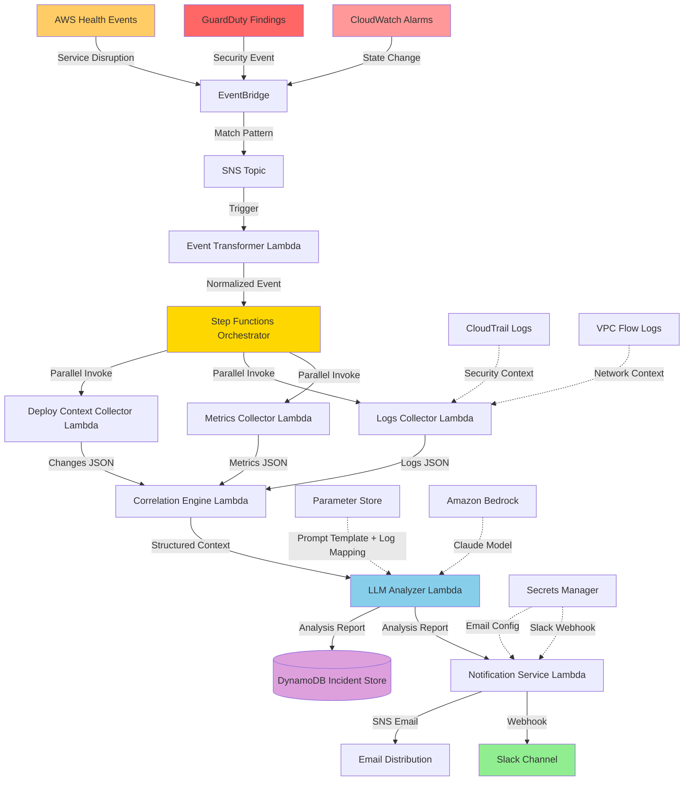

# AI-Assisted SRE Incident Analysis System

> An event-driven AWS serverless pipeline that automatically detects infrastructure incidents, security threats, and service disruptions — then collects contextual data and generates AI-powered root-cause hypotheses using Amazon Bedrock.

[](https://opensource.org/licenses/MIT)
[](https://www.python.org/downloads/)
[](https://www.terraform.io/)
[](https://aws.amazon.com/)

## Overview

This project demonstrates production-grade incident management architecture using AWS serverless technologies and AI. The system is **advisory-only** (no auto-remediation) and showcases modern SRE practices including:

- Event-driven serverless architecture on AWS
- **Multi-source event ingestion**: CloudWatch Alarms, GuardDuty security findings, AWS Health events
- **Broad resource coverage**: EC2, RDS, Lambda, SQS, ECS, API Gateway, ALB/NLB, EKS, ElastiCache, OpenSearch
- Parallel data collection with Step Functions orchestration
- LLM-powered root-cause analysis using Amazon Bedrock (Claude) with source-specific prompt templates
- Security-first design with least-privilege IAM policies
- Complete observability with structured logging, custom CloudWatch metrics, and Lambda Insights
- Configurable log group mapping via SSM Parameter Store
- Graceful degradation with partial failure handling

## Table of Contents

- [Live Demo](#live-demo)
- [Architecture](#architecture)
- [Key Features](#key-features)
- [Quick Start](#quick-start)
- [Setup Instructions](#setup-instructions)
- [Usage Examples](#usage-examples)
- [Testing](#testing-strategy)
- [Cost Estimation](#cost-estimation)
- [Troubleshooting](#troubleshooting)
- [Documentation](#documentation)
- [Technology Stack](#technology-stack)

## Live Demo

Below is a real incident alert generated by the system during a CPU stress test on an EC2 instance. The entire pipeline — from CloudWatch alarm to AI analysis to notification — completed in under 6 seconds.

### Email Notification

```
INCIDENT ALERT
============================================================

Incident ID:  83e9fc0e-c09c-40d3-a305-eb57c2d475e0
Severity:     High
Time:         2026-03-18 18:51:54 UTC
Confidence:   High

ROOT CAUSE HYPOTHESIS:
------------------------------------------------------------
Misconfigured load balancer settings leading to uneven
traffic distribution

EVIDENCE:
------------------------------------------------------------
- Sudden spike in traffic to one backend server
- Increased error rates and latency on the affected server
- No changes to application code or infrastructure in the
  past week

CONTRIBUTING FACTORS:
------------------------------------------------------------
- Potential imbalance in resource allocation between
  backend servers
- Lack of automated monitoring and alerting for load
  balancer performance

RECOMMENDED ACTIONS:
------------------------------------------------------------
1. Investigate load balancer configuration and settings
   to identify any imbalances or errors
2. Implement dynamic load balancing algorithms to distribute
   traffic more evenly across backend servers
3. Set up comprehensive monitoring and alerting for load
   balancer performance metrics
4. Conduct a full review of the load balancing strategy
   and make necessary adjustments
```

### Pipeline Execution Timeline

| Stage | Lambda | Duration | Result |
|-------|--------|----------|--------|
| Event Transformer | Unwrap SNS + start Step Functions | 102 ms | Extracted `CPUUtilization` / `AWS/EC2` / `i-0cff00728d8555799` |
| Metrics Collector | CloudWatch `GetMetricStatistics` | 325 ms | 5 metrics collected |
| Logs Collector | CloudWatch Logs `FilterLogEvents` | ~300 ms | Log entries retrieved |
| Deploy Context Collector | CloudTrail `LookupEvents` | ~300 ms | Recent changes collected |
| Correlation Engine | Normalize + merge data | ~100 ms | Structured context built |
| LLM Analyzer | Bedrock Claude 3 Haiku | 4,598 ms | Root cause analysis (high confidence) |
| Notification Service | Slack + Email delivery | 642 ms | Both channels delivered |
| **Total** | | **~6 seconds** | |

## Architecture

### High-Level Architecture Diagram



### Architecture Patterns

| Pattern | Implementation | Benefit |
|---------|---------------|---------|
| **Event-Driven** | SNS + EventBridge for component communication | Loose coupling, scalability |
| **Multi-Source Ingestion** | EventBridge rules for CloudWatch, GuardDuty, Health | Unified pipeline for diverse event types |
| **Parallel Fan-Out** | Step Functions parallel state | Minimize latency (3 collectors run simultaneously) |
| **Correlation Layer** | Dedicated Lambda for data normalization | Unified data structure for LLM |
| **Source-Specific Prompts** | Template routing by event source | Tailored analysis (infra vs security vs health) |
| **Config-Driven Mapping** | SSM Parameter Store for log group resolution | Runtime reconfiguration without redeployment |
| **Circuit Breaker** | Bedrock invocation with failure tracking | Prevent cascading failures during outages |
| **Advisory-Only AI** | LLM with explicit IAM denies | Safe recommendations without mutation risk |
| **Graceful Degradation** | Catch blocks in Step Functions | Workflow continues with partial data |

## Key Features

### Multi-Source Event Ingestion
Three event sources feed into the analysis pipeline:
- **CloudWatch Alarms**: Infrastructure metric threshold breaches (CPU, memory, errors, latency)
- **GuardDuty Findings**: Security threats including unauthorized access, compromised instances, and suspicious API calls (severity >= 4.0)
- **AWS Health Events**: Service disruptions and scheduled maintenance affecting your resources

### Broad Resource Coverage
Supports 10+ AWS resource types out of the box:

| Resource Type | Metrics | Logs | Deploy Context |
|---------------|---------|------|----------------|
| EC2 | CPU, Network, Disk | System logs | CloudTrail |
| RDS | CPU, Connections, Replica Lag | Error logs | CloudTrail |
| Lambda | Errors, Duration, Throttles | Function logs | CloudTrail |
| SQS | Queue depth, Age | - | CloudTrail |
| ECS | CPU, Memory | Container logs | CloudTrail |
| API Gateway | 5XX, Latency, Count | Access logs | CloudTrail |
| ALB | 5XX, Target Response Time | Access logs | CloudTrail |
| NLB | Flows, Processed Bytes | Access logs | CloudTrail |
| EKS | Pod/Node metrics | Control plane logs | CloudTrail |
| ElastiCache | CPU, Memory, Connections | Engine logs | CloudTrail |
| OpenSearch | CPU, JVM, Search Latency | Application logs | CloudTrail |

### Intelligent Data Collection
Three specialized collectors run in parallel:
- **Metrics Collector**: CloudWatch metrics with per-service metric configs and statistical analysis
- **Logs Collector**: Error/warning logs with configurable log group mapping, plus CloudTrail and VPC Flow Logs for security events
- **Deploy Context Collector**: Recent infrastructure changes from CloudTrail

### AI-Powered Analysis
Amazon Bedrock (Claude) generates source-specific analysis:
- **Infrastructure incidents**: Root-cause hypotheses with metric correlation
- **Security findings**: Threat assessment with containment recommendations
- **Health events**: Impact assessment with mitigation options
- Confidence levels, supporting evidence, and actionable remediation steps

### Multi-Channel Notifications
Structured alerts delivered via:
- Slack webhooks with rich formatting
- Email via SNS with HTML and plain text
- Incident store links for historical analysis

### Persistent Incident History
- 90-day retention in DynamoDB
- Queryable by resource ARN, severity, or time range
- Automatic expiration via TTL

### Complete Observability
- Structured JSON logging with correlation IDs
- Custom CloudWatch metrics for workflow tracking
- X-Ray tracing on Step Functions orchestrator
- 12 CloudWatch Alarms for system self-monitoring
- **Lambda Insights**: CPU, memory, network, and cold start monitoring for all 7 functions (opt-in via Terraform variable)

## Quick Start

### Prerequisites

- AWS account with appropriate permissions
- AWS CLI configured (`aws configure`)
- Terraform >= 1.5.0
- Python 3.11+
- Git

### 5-Minute Setup

```bash
# Clone repository
git clone <repository-url>
cd ai-sre-incident-analysis

# Set up Python environment
python3.11 -m venv venv
source venv/bin/activate
pip install -r requirements.txt

# Deploy test infrastructure
cd terraform/test-scenario
cp terraform.tfvars.example terraform.tfvars
# Edit terraform.tfvars with your SSH key name
terraform init && terraform apply

# Create secrets
aws secretsmanager create-secret \
  --name ai-sre-incident-analysis-slack-webhook \
  --secret-string '{"webhook_url":"https://hooks.slack.com/services/YOUR/WEBHOOK/URL"}'

# Create prompt template
python scripts/create_prompt_template.py

# Deploy main infrastructure
cd ../terraform
cp terraform.tfvars.example terraform.tfvars
terraform init && terraform apply

# Trigger test alarm
./scripts/trigger-test-alarm.sh
```

## Setup Instructions

### Step 1: AWS Account Setup

Configure AWS CLI with appropriate credentials:

```bash
aws configure
# Enter Access Key ID, Secret Access Key, Region (us-east-1), Output format (json)

# Verify configuration
aws sts get-caller-identity
```

### Step 2: Clone and Install Dependencies

```bash
git clone <repository-url>
cd ai-sre-incident-analysis

# Create virtual environment
python3.11 -m venv venv
source venv/bin/activate  # On Windows: venv\Scripts\activate

# Install dependencies
pip install -r requirements.txt
pip install -r requirements-dev.txt
```

### Step 3: Deploy Test Infrastructure

Deploy a simple EC2 instance with CloudWatch Alarm for testing:

```bash
cd terraform/test-scenario

# Copy and configure variables
cp terraform.tfvars.example terraform.tfvars
nano terraform.tfvars  # Update with your SSH key name and allowed IP

# Initialize and deploy
terraform init
terraform apply
```

Save the outputs:
- `instance_id`: EC2 instance ID
- `alarm_arn`: CloudWatch Alarm ARN
- `public_ip`: EC2 public IP for SSH

### Step 4: Create AWS Secrets

```bash
# Slack webhook secret
aws secretsmanager create-secret \
  --name ai-sre-incident-analysis-slack-webhook \
  --description "Slack webhook URL for incident notifications" \
  --secret-string '{"webhook_url":"https://hooks.slack.com/services/YOUR/WEBHOOK/URL"}'

# Email configuration secret
aws secretsmanager create-secret \
  --name ai-sre-incident-analysis-email-config \
  --description "Email configuration for incident notifications" \
  --secret-string '{"from_address":"incidents@example.com","recipients":["oncall@example.com"]}'
```

### Step 5: Create LLM Prompt Template

```bash
# From project root
python scripts/create_prompt_template.py
```

This stores the versioned prompt template in AWS Systems Manager Parameter Store.

### Step 6: Deploy Main Infrastructure

```bash
cd terraform

# Copy and configure variables
cp terraform.tfvars.example terraform.tfvars
nano terraform.tfvars  # Update with your configuration

# Initialize Terraform
terraform init

# Plan deployment
terraform plan -out=tfplan

# Apply deployment
terraform apply tfplan
```

Key outputs:
- `orchestrator_arn`: Step Functions state machine ARN
- `incident_table_name`: DynamoDB table name
- `notification_topic_arn`: SNS topic ARN

## Usage Examples

### Triggering a Test Alarm

Use the provided script to trigger the test alarm:

```bash
./scripts/trigger-test-alarm.sh
```

This will:
1. SSH into the EC2 instance
2. Install `stress-ng` CPU stress testing tool
3. Run CPU stress for 2 minutes
4. Monitor alarm state until it triggers

### Viewing Incidents in DynamoDB

```bash
# Query all incidents
aws dynamodb scan --table-name incident-analysis-store

# Query incidents for specific resource
aws dynamodb query \
  --table-name incident-analysis-store \
  --index-name ResourceIndex \
  --key-condition-expression "resourceArn = :arn" \
  --expression-attribute-values '{":arn":{"S":"arn:aws:ec2:us-east-1:123456789012:instance/i-abc123"}}'

# Query high-severity incidents
aws dynamodb query \
  --table-name incident-analysis-store \
  --index-name SeverityIndex \
  --key-condition-expression "severity = :sev" \
  --expression-attribute-values '{":sev":{"S":"high"}}'
```

### Viewing Step Functions Execution

```bash
# List recent executions
aws stepfunctions list-executions \
  --state-machine-arn <orchestrator-arn> \
  --max-results 10

# Get execution details
aws stepfunctions describe-execution \
  --execution-arn <execution-arn>

# Get execution history
aws stepfunctions get-execution-history \
  --execution-arn <execution-arn>
```

### Viewing CloudWatch Logs

```bash
# View metrics collector logs
aws logs tail /aws/lambda/metrics-collector --follow

# View LLM analyzer logs
aws logs tail /aws/lambda/llm-analyzer --follow

# View Step Functions logs
aws logs tail /aws/vendedlogs/states/incident-orchestrator --follow
```

### Manual Incident Trigger

You can manually trigger an incident analysis by publishing to the SNS topic:

```bash
aws sns publish \
  --topic-arn <notification-topic-arn> \
  --message '{
    "incidentId": "test-001",
    "alarmName": "HighCPUAlarm",
    "resourceArn": "arn:aws:ec2:us-east-1:123456789012:instance/i-abc123",
    "timestamp": "2024-01-15T14:30:00Z",
    "alarmState": "ALARM",
    "metricName": "CPUUtilization",
    "namespace": "AWS/EC2"
  }'
```

## Testing Strategy

### Test Types

The project includes comprehensive testing at multiple levels:

| Test Type | Framework | Coverage | Purpose |
|-----------|-----------|----------|---------|
| **Unit Tests** | pytest | 80%+ | Individual Lambda function logic |
| **Property Tests** | Hypothesis | 31 properties | Data validation and invariants |
| **Integration Tests** | pytest + moto | End-to-end | Complete workflow validation |
| **Infrastructure Tests** | pytest + Terraform | IAM policies | Security and configuration |

### Running Tests

```bash
# Run all tests
pytest

# Run unit tests only
pytest tests/unit/ -v

# Run property tests with full iterations
HYPOTHESIS_PROFILE=ci pytest tests/property/ -v

# Run with coverage report
pytest --cov=src --cov-report=html

# Run specific test file
pytest tests/unit/test_metrics_collector.py -v

# Run integration tests
pytest tests/integration/ -v
```

### Property-Based Testing

The system validates 31 correctness properties using Hypothesis:

- ✅ Event routing completeness
- ✅ Time range calculation correctness
- ✅ Data correlation and merging
- ✅ Timestamp normalization
- ✅ Context size constraints
- ✅ LLM prompt construction
- ✅ Notification message completeness
- ✅ Graceful degradation with partial data
- ✅ TTL configuration correctness
- ✅ And 22 more...

## Configuration

### Terraform Variables

Key configuration options in `terraform.tfvars`:

```hcl
# Event sources (opt-in)
enable_guardduty_events = true   # Enable GuardDuty security finding ingestion
enable_health_events    = true   # Enable AWS Health event ingestion

# Observability
enable_lambda_insights  = true   # Enable CloudWatch Lambda Insights for all functions

# Log group mapping
log_group_mapping_parameter_name = "/incident-analysis/log-group-mapping"
```

### Configurable Log Group Mapping

Log group resolution can be customized at runtime via SSM Parameter Store without redeployment:

```json
{
  "overrides": {
    "arn:aws:ec2:us-east-1:123456789012:instance/i-abc123": [
      "/custom/app/logs"
    ]
  },
  "additional": {
    "arn:aws:lambda:us-east-1:123456789012:function:my-func": [
      "/extra/debug/logs"
    ]
  }
}
```

- **overrides**: Completely replace built-in log group patterns for a specific resource ARN
- **additional**: Append extra log groups to the built-in patterns
- Changes take effect within 5 minutes (cache TTL)

## Cost Estimation

### Monthly Cost Breakdown (Low Volume - 100 incidents/month)

| Service | Usage | Monthly Cost |
|---------|-------|--------------|
| **Lambda** | 7 functions, 100 invocations | $0.00 (free tier) |
| **Step Functions** | Express, 100 executions | $0.00 (free tier) |
| **DynamoDB** | On-demand, 100 incidents | $0.25 |
| **CloudWatch Logs** | 7-day retention | $0.50 |
| **Amazon Bedrock** | Claude, 100 invocations | $3.00 |
| **CloudWatch Alarms** | 12 alarms | $1.20 |
| **Lambda Insights** | 7 functions (optional) | $0.00 (free tier) |

**Total Estimated Monthly Cost:** ~$5

### Cost Optimization Features

- ✅ **ARM64 Lambda**: 20% cost reduction vs x86
- ✅ **Express Workflows**: 5x cheaper than Standard workflows
- ✅ **On-Demand DynamoDB**: No provisioned capacity costs
- ✅ **7-Day Log Retention**: Reduced storage costs
- ✅ **90-Day TTL**: Automatic data expiration
- ✅ **Feature Toggles**: GuardDuty, Health events, and Lambda Insights are opt-in

### Free Tier Eligibility

- Lambda: 1M requests/month free
- Step Functions: 4,000 state transitions/month free
- DynamoDB: 25 GB storage free
- CloudWatch: 10 alarms free

**Expected cost within free tier:** $0-5/month

## Troubleshooting

### Alarm Not Triggering

**Problem**: CloudWatch Alarm stays in OK state after CPU spike.

**Solutions**:
- Verify alarm threshold: `aws cloudwatch describe-alarms --alarm-names test-incident-high-cpu`
- Check metrics are being published: `aws cloudwatch get-metric-statistics ...`
- Lower threshold to 10% for easier triggering
- Increase stress test duration to 5 minutes

### Lambda Function Errors

**Problem**: Lambda function fails with timeout or permission errors.

**Solutions**:
- Check CloudWatch Logs for error details
- Verify IAM role has required permissions
- Increase Lambda timeout in Terraform configuration
- Check Lambda memory allocation is sufficient

### LLM Analysis Fails

**Problem**: LLM analyzer returns fallback report.

**Solutions**:
- Verify Bedrock is enabled in your AWS region
- Check IAM role has `bedrock:InvokeModel` permission
- Verify prompt template exists in Parameter Store
- Check structured context size is < 50KB

### Notification Not Sent

**Problem**: No Slack or email notification received.

**Solutions**:
- Verify Slack webhook URL in Secrets Manager is correct
- Test webhook manually: `curl -X POST -H 'Content-type: application/json' --data '{"text":"Test"}' <webhook-url>`
- Check SNS topic has email subscription confirmed
- Review notification service CloudWatch Logs

### DynamoDB Query Errors

**Problem**: Cannot query incidents by resource or severity.

**Solutions**:
- Verify Global Secondary Indexes exist: `aws dynamodb describe-table --table-name incident-analysis-store`
- Use correct index name in query: `ResourceIndex` or `SeverityIndex`
- Ensure query uses partition key of the index

### Terraform State Lock

**Problem**: Terraform state is locked.

**Solutions**:
```bash
# List locks
aws dynamodb scan --table-name terraform-state-lock

# Force unlock (use with caution)
terraform force-unlock <lock-id>
```

## Documentation

- **[QUICKSTART.md](QUICKSTART.md)**: 10-minute quick start guide
- **[DEMO.md](docs/DEMO.md)**: Complete demo walkthrough with screenshots
- **[DESIGN.md](docs/DESIGN.md)**: Architecture patterns and design decisions
- **[RUNBOOKS.md](docs/RUNBOOKS.md)**: Operational runbooks for DLQ processing, Lambda debugging, secret rotation, and system recovery
- **[DEPLOYMENT.md](terraform/DEPLOYMENT.md)**: Detailed Terraform deployment guide
- **[PROMPT_TEMPLATE.md](docs/PROMPT_TEMPLATE.md)**: LLM prompt engineering documentation
- **[STRUCTURED_LOGGING.md](docs/STRUCTURED_LOGGING.md)**: Structured JSON logging implementation
- **[Architecture Decision Records](docs/adr/)**: Key design decisions and trade-offs
  - [ADR-001](docs/adr/001-express-vs-standard-workflows.md): Express vs Standard Step Functions
  - [ADR-002](docs/adr/002-arm64-lambda-architecture.md): ARM64 Lambda architecture
  - [ADR-003](docs/adr/003-advisory-only-llm.md): Advisory-only LLM with explicit IAM denies
  - [ADR-004](docs/adr/004-on-demand-dynamodb.md): On-demand DynamoDB billing
  - [ADR-005](docs/adr/005-parallel-fan-out-collectors.md): Parallel fan-out data collectors

## Technology Stack

### Infrastructure

| Component | Technology | Purpose |
|-----------|-----------|---------|
| **Cloud Platform** | AWS | Serverless infrastructure |
| **IaC** | Terraform | Infrastructure as Code |
| **Orchestration** | Step Functions (Express) | Workflow coordination |
| **Compute** | Lambda (Python 3.11+, ARM64) | Serverless functions |
| **Storage** | DynamoDB (on-demand) | Incident persistence |
| **Event Bus** | EventBridge + SNS | Event routing (CloudWatch, GuardDuty, Health) |
| **AI/ML** | Amazon Bedrock (Claude) | Root-cause analysis with source-specific prompts |
| **Security** | GuardDuty | Security threat detection |
| **Secrets** | Secrets Manager | Credential storage |
| **Configuration** | Parameter Store | Prompt templates, log group mapping |
| **Observability** | CloudWatch + Lambda Insights | Logging, metrics, alarms, and resource monitoring |

### Development

- **Language**: Python 3.11+
- **AWS SDK**: boto3
- **Testing**: pytest, Hypothesis (property-based testing), moto (AWS mocking)
- **CI/CD**: GitHub Actions with OIDC authentication
- **Security**: CodeQL SAST, Dependabot automated updates
- **HTTP Client**: requests (for Slack webhooks)

## Project Structure

```text
.
├── .github/
│   ├── dependabot.yml       # Automated dependency updates
│   └── workflows/
│       ├── ci-cd.yml        # CI/CD pipeline (lint, test, deploy)
│       └── codeql-analysis.yml  # SAST security scanning
├── src/                     # Lambda function source code
│   ├── metrics_collector/   # CloudWatch metrics (10+ resource types)
│   ├── logs_collector/      # Log collection with configurable mapping
│   │   ├── lambda_function.py
│   │   └── log_group_resolver.py  # SSM-backed log group resolution
│   ├── deploy_context_collector/
│   ├── correlation_engine/
│   ├── llm_analyzer/        # Bedrock integration with circuit breaker
│   │   ├── lambda_function.py
│   │   ├── prompt_builder.py      # Source-specific prompt templates
│   │   ├── response_parser.py
│   │   └── circuit_breaker.py
│   ├── notification_service/
│   ├── event_transformer/   # Multi-source event routing
│   └── shared/              # Shared utilities and models
├── terraform/               # Infrastructure as Code
│   ├── main.tf
│   ├── variables.tf
│   ├── outputs.tf
│   ├── modules/             # Reusable Terraform modules
│   │   ├── lambda/
│   │   ├── step-functions/
│   │   ├── dynamodb/
│   │   ├── eventbridge/
│   │   ├── iam/
│   │   ├── secrets/
│   │   └── cloudwatch-alarms/
│   └── test-scenario/       # Test infrastructure
├── tests/                   # Test suite
│   ├── unit/
│   ├── property/
│   ├── integration/
│   ├── infrastructure/
│   └── conftest.py
├── scripts/                 # Utility scripts
│   ├── create_prompt_template.py
│   ├── package-lambdas.sh
│   ├── trigger-test-alarm.sh
│   ├── reset-test-alarm.sh
│   ├── capture-alarm-event.sh
│   └── setup-github-oidc.sh
├── test-data/               # Captured AWS event payloads
├── docs/                    # Documentation
│   ├── adr/                 # Architecture Decision Records
│   │   ├── 001-express-vs-standard-workflows.md
│   │   ├── 002-arm64-lambda-architecture.md
│   │   ├── 003-advisory-only-llm.md
│   │   ├── 004-on-demand-dynamodb.md
│   │   └── 005-parallel-fan-out-collectors.md
│   ├── DEMO.md
│   ├── DESIGN.md
│   ├── PROMPT_TEMPLATE.md
│   ├── RUNBOOKS.md
│   └── STRUCTURED_LOGGING.md
├── requirements.txt         # Python dependencies
├── requirements-dev.txt     # Development dependencies
└── README.md               # This file
```

## Security

### Security Features

- ✅ **Least-Privilege IAM**: Each Lambda has minimal required permissions
- ✅ **LLM Restrictions**: Explicit deny for EC2, RDS, IAM, and mutating APIs
- ✅ **Secrets Management**: All credentials in AWS Secrets Manager
- ✅ **No Long-Lived Credentials**: OIDC for CI/CD authentication
- ✅ **Encryption at Rest**: KMS encryption for DynamoDB, SNS, SQS, and Secrets Manager
- ✅ **Encryption in Transit**: TLS for all API calls
- ✅ **Audit Logging**: CloudTrail enabled for all API calls
- ✅ **CodeQL SAST**: Automated static analysis for security vulnerabilities on every PR
- ✅ **Dependabot**: Automated dependency updates for Python packages and GitHub Actions
- ✅ **Lambda Concurrency Limits**: Reserved concurrency prevents runaway cost spikes

### IAM Policy Example

```json
{
  "Version": "2012-10-17",
  "Statement": [
    {
      "Effect": "Allow",
      "Action": ["bedrock:InvokeModel"],
      "Resource": "arn:aws:bedrock:*::foundation-model/anthropic.claude-v2"
    },
    {
      "Effect": "Deny",
      "Action": ["ec2:*", "rds:*", "iam:*", "lambda:Update*", "lambda:Delete*"],
      "Resource": "*"
    }
  ]
}
```

## Learning Objectives

This project demonstrates:

1. **Event-Driven Architecture**: Loose coupling via SNS/EventBridge for scalability
2. **Multi-Source Ingestion**: Unified pipeline handling infrastructure, security, and health events
3. **Parallel Processing**: Step Functions fan-out pattern for performance
4. **AI Integration**: Source-specific LLM prompts with Amazon Bedrock for tailored analysis
5. **Security Best Practices**: Least-privilege IAM, explicit denies, no credentials in code
6. **Observability**: Structured logging, custom metrics, Lambda Insights, self-monitoring alarms
7. **Config-Driven Design**: Runtime-configurable log group mapping via SSM Parameter Store
8. **Resilience Patterns**: Circuit breaker, graceful degradation, partial failure handling
9. **Infrastructure as Code**: Reproducible, version-controlled Terraform modules with feature toggles
10. **Property-Based Testing**: Hypothesis for comprehensive correctness validation

## Contributing

This is a portfolio project, but suggestions and feedback are welcome! Please open an issue to discuss proposed changes.

## License

This project is licensed under the MIT License - see the LICENSE file for details.

## Acknowledgments

Inspired by production incident management platforms:

- **Resolve AI**: Agentic AI for production engineering
- **PagerDuty AIOps**: AI-powered incident response
- **Datadog Watchdog**: Automated anomaly detection
- **AWS DevOps Agent**: Autonomous on-call engineer

---

