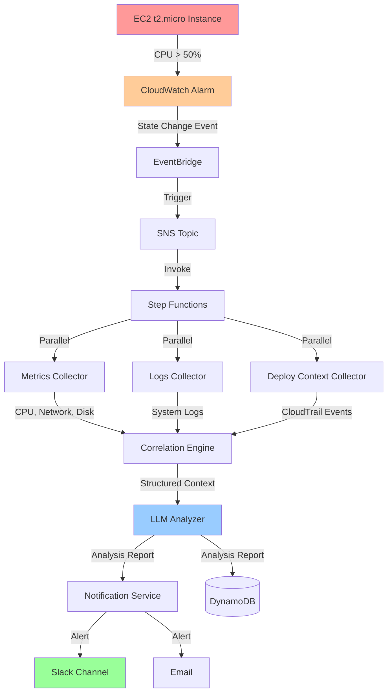

# Demo: AI-Assisted SRE Incident Analysis System

## Overview

This document demonstrates the AI-assisted incident analysis system using a real test scenario. The demo shows how the system automatically detects an infrastructure issue, collects contextual data, generates an AI-powered root-cause analysis, and notifies humans with actionable insights.

## Test Scenario: EC2 High CPU Alarm

### Scenario Description

We simulate a common production incident: an EC2 instance experiencing high CPU utilization. This scenario demonstrates:

- **Detection**: CloudWatch Alarm triggers when CPU exceeds 50%
- **Data Collection**: System gathers metrics, logs, and deployment history
- **Analysis**: LLM generates root-cause hypothesis with evidence
- **Notification**: Structured alert sent to Slack and email
- **Storage**: Complete incident record stored in DynamoDB

### Why This Scenario?

This test case is ideal because:
- **Simple to reproduce**: Single EC2 instance, easy to trigger
- **Real-world relevance**: High CPU is a common production issue
- **Rich data**: Provides metrics, logs, and CloudTrail events
- **Clear causation**: We know exactly what caused the alarm (stress test)
- **Interview-friendly**: Easy to explain and demonstrate

### Architecture Diagram



### Expected Data Flow

1. **Alarm Event** → EventBridge receives CloudWatch Alarm state change
2. **Metrics Collection** → CPU 75%, Network 1.2 MB/s, Disk 50 IOPS
3. **Logs Collection** → System logs showing high load
4. **Deploy Context** → Recent StartInstance API call
5. **Correlation** → Timeline showing CPU spike 2 minutes after instance start
6. **LLM Analysis** → "High CPU likely due to application startup or resource-intensive process"
7. **Notification** → Slack message with hypothesis and recommended actions

### Success Criteria

A successful test incident should:
- ✅ Trigger the CloudWatch Alarm within 2 minutes of CPU spike
- ✅ Collect metrics showing CPU > 50%
- ✅ Collect system logs (if CloudWatch Agent installed)
- ✅ Collect CloudTrail events (StartInstance, ModifyInstanceAttribute)
- ✅ Generate structured context < 50KB
- ✅ Produce LLM analysis with confidence level
- ✅ Send Slack notification within 2 minutes of alarm
- ✅ Store complete incident record in DynamoDB

---

## Prerequisites

### AWS Account Setup

- AWS account with appropriate permissions
- AWS CLI configured with credentials
- Terraform installed (v1.0+)
- SSH key pair for EC2 access

### Required AWS Permissions

The following permissions are needed to deploy the test infrastructure:

```json
{
  "Version": "2012-10-17",
  "Statement": [
    {
      "Effect": "Allow",
      "Action": [
        "ec2:RunInstances",
        "ec2:TerminateInstances",
        "ec2:DescribeInstances",
        "ec2:CreateSecurityGroup",
        "ec2:AuthorizeSecurityGroupIngress",
        "cloudwatch:PutMetricAlarm",
        "cloudwatch:DeleteAlarms",
        "iam:CreateRole",
        "iam:AttachRolePolicy",
        "iam:CreateInstanceProfile"
      ],
      "Resource": "*"
    }
  ]
}
```

### Cost Estimate

- **EC2 t2.micro**: ~$0.01/hour (free tier eligible)
- **CloudWatch Alarm**: Free (first 10 alarms)
- **CloudWatch Logs**: ~$0.50/GB ingested
- **Total estimated cost**: < $1 for testing

---

## Part 1: Deploy Test Infrastructure

### Step 1: Navigate to Test Scenario Directory

```bash
cd terraform/test-scenario
```

### Step 2: Initialize Terraform

```bash
terraform init
```

### Step 3: Review the Plan

```bash
terraform plan
```

You should see:
- 1 EC2 instance (t2.micro)
- 1 CloudWatch Alarm
- 1 Security Group
- 1 IAM Role and Instance Profile
- 1 CloudWatch Log Group

### Step 4: Apply the Configuration

```bash
terraform apply
```

Type `yes` when prompted.

### Step 5: Capture Outputs

```bash
terraform output
```

Save these values:
- `instance_id`: The EC2 instance ID (e.g., i-0abc123def456)
- `alarm_arn`: The CloudWatch Alarm ARN
- `log_group_name`: The CloudWatch Logs group name
- `public_ip`: The EC2 public IP for SSH access

---

## Part 2: Trigger Test Alarm

### Option A: Automated Trigger (Recommended)

Use the provided script to automatically trigger the alarm:

```bash
cd ../../scripts
./trigger-test-alarm.sh
```

This script will:
1. SSH into the EC2 instance
2. Install `stress-ng` (CPU stress testing tool)
3. Run CPU stress for 2 minutes
4. Monitor the alarm state

### Option B: Manual Trigger

If you prefer to trigger manually:

```bash
# Get the instance public IP
INSTANCE_IP=$(terraform output -raw public_ip)

# SSH into the instance
ssh -i ~/.ssh/your-key.pem ec2-user@$INSTANCE_IP

# Install stress-ng
sudo yum install -y stress-ng

# Run CPU stress test (2 minutes)
stress-ng --cpu 1 --timeout 120s

# Exit SSH
exit
```

### Verify Alarm Triggered

Check the alarm state in AWS Console or CLI:

```bash
aws cloudwatch describe-alarms \
  --alarm-names "test-incident-high-cpu" \
  --query 'MetricAlarms[0].StateValue'
```

Expected output: `"ALARM"`

---

## Part 3: Capture Event Payloads

Now that the alarm has triggered, let's capture the real AWS event data.

### Step 1: Capture CloudWatch Alarm Event

The EventBridge event is logged to CloudWatch Logs. Use the capture script:

```bash
cd scripts
./capture-alarm-event.sh
```

This creates `test-data/cloudwatch-alarm-event.json` with the actual event payload.

### Step 2: Capture Metrics Data

Query CloudWatch Metrics API to get the actual CPU data:

```bash
# Get instance ID
INSTANCE_ID=$(cd ../terraform/test-scenario && terraform output -raw instance_id)

# Query metrics for the last hour
aws cloudwatch get-metric-statistics \
  --namespace AWS/EC2 \
  --metric-name CPUUtilization \
  --dimensions Name=InstanceId,Value=$INSTANCE_ID \
  --start-time $(date -u -d '1 hour ago' +%Y-%m-%dT%H:%M:%S) \
  --end-time $(date -u +%Y-%m-%dT%H:%M:%S) \
  --period 60 \
  --statistics Average,Maximum \
  > ../test-data/sample-metrics.json
```

### Step 3: Capture Logs Data (if CloudWatch Agent installed)

```bash
# Query CloudWatch Logs
LOG_GROUP=$(cd ../terraform/test-scenario && terraform output -raw log_group_name)

aws logs filter-log-events \
  --log-group-name $LOG_GROUP \
  --start-time $(date -u -d '1 hour ago' +%s)000 \
  --filter-pattern "ERROR" \
  > ../test-data/sample-logs.json
```

### Step 4: Capture CloudTrail Events

```bash
# Query CloudTrail for EC2 events
aws cloudtrail lookup-events \
  --lookup-attributes AttributeKey=ResourceName,AttributeValue=$INSTANCE_ID \
  --start-time $(date -u -d '24 hours ago' +%Y-%m-%dT%H:%M:%S) \
  --max-results 50 \
  > ../test-data/sample-cloudtrail-events.json
```

---

## Part 4: Expected System Behavior

### Expected Structured Context

After the correlation engine processes the collected data, it should produce:

```json
{
  "incidentId": "inc-2024-001",
  "timestamp": "2024-01-15T14:30:00Z",
  "resource": {
    "arn": "arn:aws:ec2:us-east-1:123456789012:instance/i-0abc123",
    "type": "ec2",
    "name": "test-incident-instance"
  },
  "alarm": {
    "name": "test-incident-high-cpu",
    "metric": "CPUUtilization",
    "threshold": 50.0
  },
  "metrics": {
    "summary": {
      "avgCPU": 75.5,
      "maxCPU": 95.0,
      "avgNetwork": 1.2
    },
    "timeSeries": [...]
  },
  "logs": {
    "errorCount": 0,
    "topErrors": [],
    "entries": [...]
  },
  "changes": {
    "recentDeployments": 0,
    "lastChange": "2024-01-15T14:25:00Z",
    "entries": [
      {
        "timestamp": "2024-01-15T14:25:00Z",
        "changeType": "infrastructure",
        "eventName": "StartInstances",
        "user": "arn:aws:iam::123456789012:user/admin"
      }
    ]
  },
  "completeness": {
    "metrics": true,
    "logs": true,
    "changes": true
  }
}
```

### Expected LLM Analysis

The LLM should generate an analysis like:

```json
{
  "incidentId": "inc-2024-001",
  "timestamp": "2024-01-15T14:30:30Z",
  "analysis": {
    "rootCauseHypothesis": "EC2 instance CPU utilization exceeded threshold due to resource-intensive process or application startup",
    "confidence": "medium",
    "evidence": [
      "CPU utilization spiked to 95% at 14:30 UTC",
      "Instance was started 5 minutes before the alarm",
      "No recent deployments or configuration changes detected"
    ],
    "contributingFactors": [
      "t2.micro instance may be undersized for workload",
      "No CPU throttling or burst balance issues detected"
    ],
    "recommendedActions": [
      "SSH into instance and check running processes with 'top' or 'htop'",
      "Review application logs for startup errors or resource-intensive operations",
      "Consider upgrading to larger instance type if sustained high CPU",
      "Set up CloudWatch Agent for detailed process-level metrics"
    ]
  },
  "metadata": {
    "modelId": "anthropic.claude-v2",
    "modelVersion": "2.1",
    "promptVersion": "v1.0",
    "tokenUsage": {"input": 1200, "output": 250},
    "latency": 2.3
  }
}
```

### Expected Slack Notification

The Slack message should look like:

```
🚨 *Incident Alert: High CPU Utilization*

*Resource:* EC2 instance `test-incident-instance` (i-0abc123)
*Severity:* Medium
*Time:* 2024-01-15 14:30:00 UTC

*Root Cause Hypothesis (Medium Confidence):*
EC2 instance CPU utilization exceeded threshold due to resource-intensive process or application startup

*Evidence:*
• CPU utilization spiked to 95% at 14:30 UTC
• Instance was started 5 minutes before the alarm
• No recent deployments or configuration changes detected

*Recommended Actions:*
1. SSH into instance and check running processes with 'top' or 'htop'
2. Review application logs for startup errors or resource-intensive operations
3. Consider upgrading to larger instance type if sustained high CPU
4. Set up CloudWatch Agent for detailed process-level metrics

<https://console.aws.amazon.com/dynamodb/incident/inc-2024-001|View Full Incident Details>
```

---

## Part 5: Reset Test Environment

### Reset the Alarm

```bash
cd scripts
./reset-test-alarm.sh
```

This will:
1. Stop any running stress tests
2. Wait for CPU to return to normal
3. Verify alarm returns to OK state

### Destroy Test Infrastructure (Optional)

If you want to tear down the test environment:

```bash
cd terraform/test-scenario
terraform destroy
```

Type `yes` when prompted.

---

## Troubleshooting

### Alarm Not Triggering

**Problem**: Alarm stays in OK state even after CPU spike.

**Solutions**:
- Check alarm threshold: `aws cloudwatch describe-alarms --alarm-names test-incident-high-cpu`
- Verify metrics are being published: `aws cloudwatch get-metric-statistics ...`
- Lower the threshold to 10% for easier triggering
- Increase stress test duration to 5 minutes

### Cannot SSH into EC2 Instance

**Problem**: Connection timeout when trying to SSH.

**Solutions**:
- Verify security group allows SSH from your IP: `terraform output security_group_id`
- Check instance is running: `aws ec2 describe-instances --instance-ids <id>`
- Verify you're using the correct key pair
- Check VPC and subnet configuration

### No Logs in CloudWatch

**Problem**: CloudWatch Logs group is empty.

**Solutions**:
- CloudWatch Agent may not be installed (this is optional for the test)
- Verify IAM role has CloudWatch Logs permissions
- Check agent status: `sudo systemctl status amazon-cloudwatch-agent`
- Logs are optional - the system should work without them

### CloudTrail Events Not Found

**Problem**: No CloudTrail events returned.

**Solutions**:
- CloudTrail may not be enabled in your account
- Events can take 15 minutes to appear
- Check CloudTrail is logging management events
- Deploy context collector should handle empty results gracefully

---

## Next Steps

Once you've successfully run the test scenario:

1. ✅ You have real AWS event payloads in `test-data/`
2. ✅ You understand the exact data flow
3. ✅ You can start building Lambda functions with real test data
4. ✅ You have a working demo for interviews

**Ready to build the main system?** Proceed to Task 1 in `tasks.md`.

---

## Sample Incident Scenarios

This section provides multiple realistic incident scenarios to demonstrate the system's capabilities across different AWS services and failure modes.

### Scenario 1: Lambda Function Memory Exhaustion

**Description**: A Lambda function experiences memory exhaustion after a recent deployment, causing invocation failures.

**Trigger**: CloudWatch Alarm on Lambda Errors metric > 10 errors in 5 minutes

**Expected Metrics**:
- Memory utilization: 95-100% (approaching 1024 MB limit)
- Duration: Increasing from 200ms to 800ms before failure
- Invocations: 150 invocations in the time window
- Errors: 15 errors (10% error rate)

**Expected Logs**:
```
[ERROR] Runtime.ExitError: RequestId: abc-123 Error: Runtime exited with error: signal: killed
[ERROR] MemoryError: Unable to allocate memory for operation
[WARN] Memory usage at 98% of allocated limit
```

**Expected Deploy Context**:
- Lambda function code updated 5 minutes before incident
- Environment variable `BATCH_SIZE` changed from 100 to 1000
- No infrastructure changes

**Expected LLM Analysis**:
```json
{
  "rootCauseHypothesis": "Lambda function exhausted allocated memory due to increased batch size in recent deployment",
  "confidence": "high",
  "evidence": [
    "Memory utilization reached 100% at 14:30 UTC",
    "Error logs show 'MemoryError' and 'Runtime.ExitError' starting at 14:30",
    "Function code updated 5 minutes before incident",
    "Environment variable BATCH_SIZE increased from 100 to 1000",
    "Duration increased 4x before failures began"
  ],
  "contributingFactors": [
    "Memory limit (1024 MB) not adjusted after batch size increase",
    "No load testing performed after deployment",
    "Increased traffic during peak hours"
  ],
  "recommendedActions": [
    "Rollback deployment to previous version immediately",
    "Increase Lambda memory limit to 2048 MB or 3008 MB",
    "Reduce BATCH_SIZE to 500 or implement pagination",
    "Add memory usage monitoring and alarms",
    "Implement load testing in CI/CD pipeline"
  ]
}
```

---

### Scenario 2: RDS Database Connection Pool Exhaustion

**Description**: An RDS database experiences connection pool exhaustion, causing application timeouts.

**Trigger**: CloudWatch Alarm on RDS DatabaseConnections > 80 (max_connections = 100)

**Expected Metrics**:
- DatabaseConnections: 95-100 connections
- CPUUtilization: 45% (not CPU-bound)
- ReadLatency: 50ms (normal)
- WriteLatency: 200ms (elevated)

**Expected Logs**:
```
[ERROR] psycopg2.OperationalError: FATAL: remaining connection slots are reserved
[ERROR] Database connection timeout after 30 seconds
[WARN] Connection pool exhausted, waiting for available connection
```

**Expected Deploy Context**:
- Application deployment 15 minutes before incident
- New feature added: background job processing
- No database parameter changes

**Expected LLM Analysis**:
```json
{
  "rootCauseHypothesis": "RDS connection pool exhausted due to new background jobs not releasing connections properly",
  "confidence": "high",
  "evidence": [
    "DatabaseConnections metric reached 100 at 09:15 UTC",
    "Application logs show connection timeout errors starting at 09:15",
    "Application deployed 15 minutes before incident with new background job feature",
    "No increase in request volume or CPU utilization",
    "Write latency elevated, indicating connection contention"
  ],
  "contributingFactors": [
    "Background jobs may not be closing database connections",
    "Connection pool size not adjusted for additional workload",
    "No connection timeout or max lifetime configured"
  ],
  "recommendedActions": [
    "Review background job code for connection leaks",
    "Implement connection pooling with max lifetime (e.g., 5 minutes)",
    "Increase RDS max_connections parameter to 200",
    "Add connection pool monitoring and alerting",
    "Consider using RDS Proxy for connection pooling"
  ]
}
```

---

### Scenario 3: EC2 Instance Disk Space Exhaustion

**Description**: An EC2 instance runs out of disk space, causing application failures.

**Trigger**: CloudWatch Alarm on disk_used_percent > 90%

**Expected Metrics**:
- disk_used_percent: 95%
- disk_free: 500 MB (out of 10 GB)
- CPUUtilization: 25% (normal)
- NetworkIn: 1.5 MB/s (normal)

**Expected Logs**:
```
[ERROR] OSError: [Errno 28] No space left on device
[ERROR] Failed to write log file: disk full
[WARN] Disk usage at 95%, only 500 MB remaining
```

**Expected Deploy Context**:
- No recent deployments
- No configuration changes
- Instance running for 45 days

**Expected LLM Analysis**:
```json
{
  "rootCauseHypothesis": "EC2 instance disk space exhausted due to log file accumulation over time",
  "confidence": "medium",
  "evidence": [
    "Disk usage at 95% with only 500 MB free",
    "Error logs show 'No space left on device' errors",
    "No recent deployments or configuration changes",
    "Instance has been running for 45 days without maintenance"
  ],
  "contributingFactors": [
    "Log rotation may not be configured properly",
    "Application logs not being archived or deleted",
    "No disk space monitoring or cleanup automation"
  ],
  "recommendedActions": [
    "SSH into instance and identify large files with 'du -sh /*'",
    "Clean up old log files in /var/log and application directories",
    "Configure log rotation with logrotate",
    "Implement CloudWatch Logs Agent to ship logs off-instance",
    "Set up automated disk cleanup scripts",
    "Consider increasing EBS volume size to 20 GB"
  ]
}
```

---

### Scenario 4: API Gateway Throttling

**Description**: API Gateway throttles requests due to burst limit exceeded.

**Trigger**: CloudWatch Alarm on 4XXError > 100 in 5 minutes

**Expected Metrics**:
- Count: 5000 requests in 1 minute
- 4XXError: 2500 (50% error rate)
- Latency: 50ms (normal for successful requests)
- IntegrationLatency: 45ms (backend healthy)

**Expected Logs**:
```
[ERROR] API Gateway: Rate exceeded - 429 Too Many Requests
[WARN] Throttling limit reached: 1000 requests per second
```

**Expected Deploy Context**:
- No API Gateway changes
- Marketing campaign launched 10 minutes ago
- No backend deployments

**Expected LLM Analysis**:
```json
{
  "rootCauseHypothesis": "API Gateway throttling due to sudden traffic spike from marketing campaign exceeding burst limit",
  "confidence": "high",
  "evidence": [
    "Request count spiked to 5000 requests/minute at 11:00 UTC",
    "50% of requests returning 429 Too Many Requests errors",
    "Marketing campaign launched 10 minutes before incident",
    "Backend latency normal, indicating API Gateway throttling not backend issue",
    "No API Gateway configuration changes"
  ],
  "contributingFactors": [
    "Default API Gateway throttling limits (1000 RPS burst)",
    "No traffic spike preparation for marketing campaign",
    "No rate limiting at application layer"
  ],
  "recommendedActions": [
    "Request AWS Support to increase API Gateway throttling limits",
    "Implement exponential backoff and retry logic in clients",
    "Add CloudFront in front of API Gateway for caching",
    "Coordinate with marketing team on campaign launches",
    "Implement application-level rate limiting and queueing",
    "Consider usage plans and API keys for different customer tiers"
  ]
}
```

---

### Scenario 5: DynamoDB Hot Partition

**Description**: A DynamoDB table experiences throttling due to hot partition from uneven access pattern.

**Trigger**: CloudWatch Alarm on UserErrors > 50 in 5 minutes

**Expected Metrics**:
- ConsumedReadCapacityUnits: 3000 (on-demand mode)
- UserErrors: 150 (ThrottlingException)
- SuccessfulRequestLatency: 5ms (normal)
- SystemErrors: 0

**Expected Logs**:
```
[ERROR] botocore.exceptions.ClientError: ProvisionedThroughputExceededException
[ERROR] DynamoDB throttling on partition key: user_123
[WARN] Hot partition detected: 80% of reads on single partition
```

**Expected Deploy Context**:
- New feature deployed 30 minutes ago: user activity dashboard
- No DynamoDB table changes
- Application code updated

**Expected LLM Analysis**:
```json
{
  "rootCauseHypothesis": "DynamoDB throttling due to hot partition caused by new dashboard feature querying single user repeatedly",
  "confidence": "high",
  "evidence": [
    "UserErrors metric shows 150 ThrottlingExceptions at 16:45 UTC",
    "Application logs indicate 80% of reads targeting single partition key",
    "New user activity dashboard feature deployed 30 minutes before incident",
    "On-demand mode should handle traffic, suggesting hot partition issue",
    "No table configuration changes"
  ],
  "contributingFactors": [
    "Dashboard polling user data every second without caching",
    "Partition key design may not distribute load evenly",
    "No caching layer (ElastiCache) for frequently accessed data"
  ],
  "recommendedActions": [
    "Implement caching for dashboard data (TTL: 60 seconds)",
    "Add ElastiCache layer for hot data",
    "Review partition key design - consider composite keys",
    "Implement request coalescing for duplicate queries",
    "Add DynamoDB DAX for read-heavy workloads",
    "Rate limit dashboard refresh to max 1 request per 5 seconds"
  ]
}
```

---

## Expected System Outputs

### Complete Structured Context Example

This is what the Correlation Engine produces after merging all collector outputs:

```json
{
  "incidentId": "inc-2024-01-15-143000-abc123",
  "timestamp": "2024-01-15T14:30:00Z",
  "resource": {
    "arn": "arn:aws:lambda:us-east-1:123456789012:function:payment-processor",
    "type": "lambda",
    "name": "payment-processor",
    "region": "us-east-1",
    "account": "123456789012"
  },
  "alarm": {
    "name": "payment-processor-high-errors",
    "arn": "arn:aws:cloudwatch:us-east-1:123456789012:alarm:payment-processor-high-errors",
    "metric": "Errors",
    "namespace": "AWS/Lambda",
    "threshold": 10.0,
    "evaluationPeriods": 1,
    "period": 300
  },
  "metrics": {
    "summary": {
      "errorCount": 15,
      "errorRate": 0.10,
      "avgDuration": 650.5,
      "maxDuration": 850.0,
      "avgMemoryUsed": 980.0,
      "maxMemoryUsed": 1024.0,
      "invocations": 150
    },
    "timeSeries": [
      {
        "timestamp": "2024-01-15T13:30:00Z",
        "metric": "Duration",
        "value": 200.0,
        "unit": "Milliseconds"
      },
      {
        "timestamp": "2024-01-15T14:25:00Z",
        "metric": "Duration",
        "value": 800.0,
        "unit": "Milliseconds"
      },
      {
        "timestamp": "2024-01-15T14:30:00Z",
        "metric": "Errors",
        "value": 15.0,
        "unit": "Count"
      }
    ]
  },
  "logs": {
    "errorCount": 15,
    "warnCount": 8,
    "topErrors": [
      "MemoryError: Unable to allocate memory",
      "Runtime.ExitError: signal: killed"
    ],
    "entries": [
      {
        "timestamp": "2024-01-15T14:30:15Z",
        "logLevel": "ERROR",
        "message": "MemoryError: Unable to allocate memory for batch processing",
        "logStream": "2024/01/15/[$LATEST]abc123"
      },
      {
        "timestamp": "2024-01-15T14:30:18Z",
        "logLevel": "ERROR",
        "message": "Runtime.ExitError: RequestId: xyz-789 Error: Runtime exited with error: signal: killed",
        "logStream": "2024/01/15/[$LATEST]abc123"
      }
    ]
  },
  "changes": {
    "recentDeployments": 1,
    "lastDeployment": "2024-01-15T14:25:00Z",
    "configChanges": 1,
    "entries": [
      {
        "timestamp": "2024-01-15T14:25:00Z",
        "changeType": "deployment",
        "eventName": "UpdateFunctionCode20150331v2",
        "user": "arn:aws:sts::123456789012:assumed-role/DeploymentRole/github-actions",
        "description": "Lambda function code updated via GitHub Actions",
        "details": {
          "codeSize": 5242880,
          "runtime": "python3.11"
        }
      },
      {
        "timestamp": "2024-01-15T14:25:05Z",
        "changeType": "configuration",
        "eventName": "UpdateFunctionConfiguration20150331v2",
        "user": "arn:aws:sts::123456789012:assumed-role/DeploymentRole/github-actions",
        "description": "Lambda environment variables updated",
        "details": {
          "environment": {
            "BATCH_SIZE": "1000"
          }
        }
      }
    ]
  },
  "completeness": {
    "metrics": true,
    "logs": true,
    "changes": true
  },
  "correlations": [
    {
      "type": "deployment_before_incident",
      "description": "Deployment occurred 5 minutes before incident",
      "confidence": "high"
    },
    {
      "type": "config_change_correlation",
      "description": "BATCH_SIZE increased 10x coinciding with memory errors",
      "confidence": "high"
    }
  ]
}
```

### Complete Analysis Report Example

This is what the LLM Analyzer produces:

```json
{
  "incidentId": "inc-2024-01-15-143000-abc123",
  "timestamp": "2024-01-15T14:30:45Z",
  "analysis": {
    "rootCauseHypothesis": "Lambda function exhausted allocated memory due to 10x increase in BATCH_SIZE environment variable in recent deployment",
    "confidence": "high",
    "evidence": [
      "Memory utilization reached 100% (1024 MB limit) at 14:30 UTC",
      "Error logs show 'MemoryError' and 'Runtime.ExitError: signal: killed' starting at 14:30",
      "Function code and configuration updated at 14:25 UTC (5 minutes before incident)",
      "Environment variable BATCH_SIZE increased from 100 to 1000 (10x increase)",
      "Function duration increased from 200ms to 800ms before failures",
      "15 errors out of 150 invocations (10% error rate)"
    ],
    "contributingFactors": [
      "Memory limit (1024 MB) not adjusted when batch size increased",
      "No load testing performed after deployment to validate memory requirements",
      "Increased traffic during peak hours amplified the issue",
      "No gradual rollout or canary deployment strategy"
    ],
    "recommendedActions": [
      "Immediate: Rollback deployment to previous version to restore service",
      "Short-term: Increase Lambda memory limit to 2048 MB or 3008 MB",
      "Short-term: Reduce BATCH_SIZE to 500 or implement pagination for large batches",
      "Medium-term: Add memory usage monitoring with CloudWatch alarms at 80% threshold",
      "Medium-term: Implement load testing in CI/CD pipeline before production deployment",
      "Long-term: Implement canary deployments with automatic rollback on errors",
      "Long-term: Add memory profiling to identify memory-intensive operations"
    ],
    "severity": "high",
    "impactAssessment": "10% of payment processing requests failing, potential revenue impact",
    "timeToResolve": "5-10 minutes (rollback) or 15-20 minutes (memory increase)"
  },
  "metadata": {
    "modelId": "anthropic.claude-v2",
    "modelVersion": "2.1",
    "promptVersion": "v1.0",
    "tokenUsage": {
      "input": 1850,
      "output": 420
    },
    "latency": 3.2,
    "temperature": 0.3,
    "analysisTimestamp": "2024-01-15T14:30:45Z"
  }
}
```

### Complete Slack Notification Example

This is what appears in the Slack channel:

```
🚨 *INCIDENT ALERT: Lambda Memory Exhaustion*

━━━━━━━━━━━━━━━━━━━━━━━━━━━━━━━━━━━━━━━━

*Resource:* Lambda function `payment-processor`
*Region:* us-east-1
*Severity:* 🔴 HIGH
*Time:* 2024-01-15 14:30:00 UTC
*Incident ID:* inc-2024-01-15-143000-abc123

━━━━━━━━━━━━━━━━━━━━━━━━━━━━━━━━━━━━━━━━

*🎯 Root Cause (High Confidence):*
Lambda function exhausted allocated memory due to 10x increase in BATCH_SIZE environment variable in recent deployment

*📊 Evidence:*
• Memory utilization reached 100% (1024 MB limit) at 14:30 UTC
• Error logs show 'MemoryError' and 'Runtime.ExitError: signal: killed'
• Function deployed 5 minutes before incident (14:25 UTC)
• BATCH_SIZE increased from 100 to 1000 (10x increase)
• Duration increased from 200ms to 800ms before failures
• 15 errors out of 150 invocations (10% error rate)

*⚠️ Contributing Factors:*
• Memory limit not adjusted when batch size increased
• No load testing performed after deployment
• Peak traffic hours amplified the issue

*✅ Recommended Actions:*
1. *IMMEDIATE:* Rollback deployment to previous version
2. Increase Lambda memory to 2048 MB or 3008 MB
3. Reduce BATCH_SIZE to 500 or implement pagination
4. Add memory monitoring with 80% threshold alarm
5. Implement load testing in CI/CD pipeline
6. Consider canary deployments with auto-rollback

*📈 Impact:*
10% of payment processing requests failing, potential revenue impact

*⏱️ Estimated Resolution Time:*
5-10 minutes (rollback) or 15-20 minutes (memory increase)

━━━━━━━━━━━━━━━━━━━━━━━━━━━━━━━━━━━━━━━━

*🔗 Links:*
• <https://console.aws.amazon.com/lambda/home?region=us-east-1#/functions/payment-processor|Lambda Function>
• <https://console.aws.amazon.com/cloudwatch/home?region=us-east-1#alarmsV2:alarm/payment-processor-high-errors|CloudWatch Alarm>
• <https://console.aws.amazon.com/dynamodb/home?region=us-east-1#item-explorer?table=incident-analysis-store&pk=inc-2024-01-15-143000-abc123|Full Incident Details>

*📞 On-Call:* @sre-team @platform-team
```

---

## Screenshots and Visual Documentation

### 1. AWS Console - CloudWatch Alarm in ALARM State

**What to capture:**
- CloudWatch Alarms dashboard showing alarm in ALARM state (red)
- Alarm history showing state transition from OK to ALARM
- Alarm configuration showing threshold and evaluation periods
- Graph showing metric exceeding threshold

**Screenshot placeholder:**
```
[Screenshot: CloudWatch Alarm Dashboard]
- Alarm name: payment-processor-high-errors
- State: ALARM (red indicator)
- Metric: AWS/Lambda Errors
- Threshold: 10 errors in 5 minutes
- Current value: 15 errors
- Graph showing spike at 14:30 UTC
```

### 2. AWS Console - Lambda Function Metrics

**What to capture:**
- Lambda monitoring tab showing all metrics
- Duration metric graph showing increase over time
- Errors metric graph showing spike
- Memory utilization approaching limit
- Invocations count

**Screenshot placeholder:**
```
[Screenshot: Lambda Monitoring Dashboard]
- Function: payment-processor
- Duration: 200ms → 800ms (4x increase)
- Errors: 0 → 15 (spike at 14:30)
- Memory: 60% → 100% (maxed out)
- Invocations: 150 in 5 minutes
- Time range: 13:30 - 14:35 UTC
```

### 3. AWS Console - CloudWatch Logs Insights

**What to capture:**
- Logs Insights query showing ERROR level messages
- Error messages with timestamps
- Log stream names
- Query used to filter logs

**Screenshot placeholder:**
```
[Screenshot: CloudWatch Logs Insights]
Query: fields @timestamp, @message | filter @message like /ERROR/ | sort @timestamp desc

Results:
14:30:15 | MemoryError: Unable to allocate memory for batch processing
14:30:18 | Runtime.ExitError: RequestId: xyz-789 Error: signal: killed
14:30:22 | MemoryError: Unable to allocate memory for batch processing
...
(15 error messages shown)
```

### 4. AWS Console - CloudTrail Events

**What to capture:**
- CloudTrail event history for the Lambda function
- UpdateFunctionCode event
- UpdateFunctionConfiguration event
- Event details showing BATCH_SIZE change

**Screenshot placeholder:**
```
[Screenshot: CloudTrail Event History]
Event time: 2024-01-15 14:25:00 UTC
Event name: UpdateFunctionConfiguration20150331v2
User: arn:aws:sts::123456789012:assumed-role/DeploymentRole/github-actions
Resource: payment-processor
Changes:
  Environment variables:
    BATCH_SIZE: 100 → 1000
```

### 5. Slack Notification

**What to capture:**
- Complete Slack message in channel
- Formatting with emojis and sections
- Clickable links
- Mentions of on-call teams

**Screenshot placeholder:**
```
[Screenshot: Slack Channel #incidents]
- Message from "AI-SRE Bot" at 14:30:45
- Red alert emoji and HIGH severity indicator
- Formatted sections with evidence and recommendations
- Blue hyperlinks to AWS Console
- @sre-team and @platform-team mentions highlighted
```

### 6. DynamoDB Incident Record

**What to capture:**
- DynamoDB console showing incident table
- Item explorer with incident ID
- JSON view of complete incident record
- TTL field showing 90-day expiration

**Screenshot placeholder:**
```
[Screenshot: DynamoDB Item Explorer]
Table: incident-analysis-store
Partition key: inc-2024-01-15-143000-abc123
Sort key: 2024-01-15T14:30:00Z

Attributes:
- incidentId: inc-2024-01-15-143000-abc123
- timestamp: 2024-01-15T14:30:00Z
- resourceArn: arn:aws:lambda:us-east-1:123456789012:function:payment-processor
- resourceType: lambda
- severity: high
- structuredContext: {JSON object}
- analysisReport: {JSON object}
- notificationStatus: {"slack": "delivered", "email": "delivered"}
- ttl: 1723737000 (90 days from incident)
```

### 7. Step Functions Execution Graph

**What to capture:**
- Step Functions console showing execution graph
- All states colored green (success) or red (failure)
- Parallel execution of collectors
- Sequential execution of correlation, analysis, notification
- Execution time for each state

**Screenshot placeholder:**
```
[Screenshot: Step Functions Execution Graph]
Execution: arn:aws:states:us-east-1:123456789012:execution:incident-orchestrator:inc-2024-01-15-143000-abc123
Status: Succeeded
Duration: 45.2 seconds

Graph:
├─ ParallelDataCollection (15.3s)
│  ├─ CollectMetrics (12.1s) ✓
│  ├─ CollectLogs (14.8s) ✓
│  └─ CollectDeployContext (10.5s) ✓
├─ CorrelateData (2.1s) ✓
├─ AnalyzeWithLLM (18.5s) ✓
└─ NotifyAndStore (9.3s)
   ├─ SendNotification (8.7s) ✓
   └─ StoreIncident (5.2s) ✓
```

### 8. CloudWatch Dashboard

**What to capture:**
- Custom dashboard showing system health metrics
- Workflow success rate
- Collector performance
- LLM invocation latency
- Notification delivery status

**Screenshot placeholder:**
```
[Screenshot: CloudWatch Custom Dashboard - AI-SRE System Health]

Widgets:
┌─────────────────────────────────────┐
│ Workflow Success Rate (24h)        │
│ ████████████████████░░ 95.2%       │
└─────────────────────────────────────┘

┌─────────────────────────────────────┐
│ Collector Performance               │
│ Metrics:  12.1s avg (✓ < 15s)      │
│ Logs:     14.8s avg (✓ < 20s)      │
│ Changes:  10.5s avg (✓ < 15s)      │
└─────────────────────────────────────┘

┌─────────────────────────────────────┐
│ LLM Invocation Latency              │
│ p50: 2.1s  p95: 5.8s  p99: 12.3s   │
└─────────────────────────────────────┘

┌─────────────────────────────────────┐
│ Notification Delivery (24h)         │
│ Slack: 98.5% success                │
│ Email: 99.2% success                │
└─────────────────────────────────────┘
```

---

## How to Capture Screenshots

### Prerequisites
- AWS Console access with appropriate permissions
- Deployed AI-SRE system in dev/staging environment
- Test incident triggered (see Part 2 of this document)

### Step-by-Step Screenshot Guide

1. **CloudWatch Alarm**:
   - Navigate to CloudWatch → Alarms
   - Click on the triggered alarm
   - Capture full screen showing alarm state, graph, and history

2. **Lambda Metrics**:
   - Navigate to Lambda → Functions → [function-name]
   - Click "Monitor" tab
   - Scroll to capture Duration, Errors, and Memory graphs
   - Adjust time range to show before/during/after incident

3. **CloudWatch Logs**:
   - Navigate to CloudWatch → Logs Insights
   - Select log group: `/aws/lambda/[function-name]`
   - Run query: `fields @timestamp, @message | filter @message like /ERROR/ | sort @timestamp desc`
   - Capture query and results

4. **CloudTrail Events**:
   - Navigate to CloudTrail → Event history
   - Filter by Resource name: [function-name]
   - Filter by Time range: Last hour
   - Click on UpdateFunctionConfiguration event
   - Capture event details JSON

5. **Slack Notification**:
   - Open Slack workspace
   - Navigate to #incidents channel
   - Locate AI-SRE Bot message
   - Capture full message with formatting

6. **DynamoDB Record**:
   - Navigate to DynamoDB → Tables → incident-analysis-store
   - Click "Explore table items"
   - Search for incident ID
   - Click on item to view details
   - Switch to JSON view
   - Capture full JSON (may need multiple screenshots)

7. **Step Functions Execution**:
   - Navigate to Step Functions → State machines
   - Click on incident-orchestrator
   - Click on recent execution
   - Capture execution graph showing all states
   - Click "Execution details" for timing information

8. **CloudWatch Dashboard**:
   - Navigate to CloudWatch → Dashboards
   - Create custom dashboard with system metrics
   - Add widgets for success rate, latency, delivery status
   - Capture full dashboard

### Screenshot Naming Convention

Save screenshots with descriptive names:
- `01-cloudwatch-alarm-high-errors.png`
- `02-lambda-metrics-memory-spike.png`
- `03-cloudwatch-logs-error-messages.png`
- `04-cloudtrail-deployment-event.png`
- `05-slack-notification-formatted.png`
- `06-dynamodb-incident-record.png`
- `07-step-functions-execution-graph.png`
- `08-cloudwatch-dashboard-system-health.png`

---

## Demo Presentation Tips

When presenting this system in interviews or demos:

1. **Start with the problem**: Explain the challenge of incident response at scale
2. **Show the architecture**: Walk through the event-driven design
3. **Trigger a live incident**: Use the test scenario to show real-time processing
4. **Highlight key features**:
   - Parallel data collection (speed)
   - LLM-powered analysis (intelligence)
   - Graceful degradation (reliability)
   - Least-privilege IAM (security)
5. **Show the Slack notification**: Emphasize actionable insights
6. **Discuss trade-offs**: Express vs Standard workflows, cost optimization
7. **Explain testing strategy**: Property-based tests for correctness
8. **Show the code**: Highlight clean architecture and error handling

### Key Talking Points

- "This mirrors production systems like PagerDuty AIOps and Datadog Watchdog"
- "The LLM is advisory-only with explicit IAM denies for infrastructure changes"
- "Graceful degradation ensures partial data is better than no analysis"
- "Property-based testing validates correctness across all inputs"
- "Cost-optimized for portfolio projects: Express workflows, on-demand DynamoDB"
